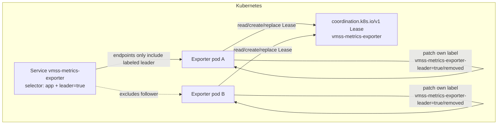

# Leader election implementation

This document explains the active/standby leader election implementation used by
`vmss-metrics-exporter`, why it exists, how it differs from the upstream Python
`kubernetes.leaderelection` helper, and how to operate/debug it in AKS.

## Goals

The exporter runs with two replicas for high availability, but only one replica
must actively collect Azure Resource Graph and Azure Monitor metrics at a time.
The design goals are:

1. **Exactly one active collector in normal operation** — avoid duplicate Azure
   API calls and duplicate resource series.
2. **Fast graceful handoff** — rolling updates should transfer leadership in
   roughly one retry period plus first collection latency, not a full lease
   timeout.
3. **No blank Service scrapes** — Prometheus/Grafana scrapes via the Kubernetes
   Service must not randomly hit an idle follower exposing zero resource series.
4. **Client-go-like safety** — use Kubernetes Lease semantics, optimistic
   concurrency, local monotonic observation time, and bounded API request
   timeouts.
5. **Safe shutdown** — release the Lease without clearing the terminating pod's
   metrics while it can still be scraped.

## Files involved

| File | Responsibility |
|---|---|
| `src/vmss_metrics_exporter/leader_election.py` | Native `coordination.k8s.io/v1 Lease` election loop. |
| `src/vmss_metrics_exporter/main.py` | Wires election callbacks into exporter leadership state and Service label management. |
| `src/vmss_metrics_exporter/collector.py` | Starts/stops polling, clears follower gauges, and wakes pollers immediately on leadership acquisition. |
| `deploy/kubernetes.yaml` | RBAC, Deployment, leader-election env vars, and Service selector. |
| `tests/test_leader_election.py` | Unit coverage for Lease acquisition, renewal, release, conflicts, local-time expiry, and request timeouts. |
| `tests/test_main.py` | Unit coverage for leader callback ordering and pod label patching. |
| `tests/test_collector.py` | Unit coverage for poller wake-up and follower gauge clearing. |

## High-level architecture



There are two separate control planes:

1. **Leadership control plane** — the Lease decides which pod is leader.
2. **Scrape routing control plane** — the leader pod gets label
   `vmss-metrics-exporter-leader=true`, and the Service selector includes this
   label so Service-based scrapes go only to the leader.

The second control plane is important. Direct pod scrapes are naturally accurate
because the leader exposes resource metrics and followers expose zeros. However,
a normal Kubernetes Service load-balances across all matching ready pods. If the
Service selects both leader and follower, a Prometheus scrape can randomly hit the
follower and record blank/zero VMSS series. The leader label fixes that.

## Why not use the upstream Python leader-election helper?

The previous implementation wrapped `kubernetes.leaderelection` with
`ConfigMapLock`. That was replaced because:

- The Python helper only provided a ConfigMap lock in the used client version.
- ConfigMap-based leader election is obsolete compared with
  `coordination.k8s.io/v1 Lease`.
- It did not actively release the lock on process shutdown, so a rollout waited
  for lease expiry before the standby could acquire.
- It had blocking internal sleep behavior that is hard to interrupt
  cooperatively.

The current implementation keeps the repository-facing public API stable:

- `LeaderElectionConfig`
- `LeaderElectionRunner`
- `load_incluster_kube_config()`

but replaces the internals with native Lease operations.

## Client-go behavior used as the reference

The implementation intentionally mirrors the important production semantics from
Kubernetes `client-go` leader election:

| client-go concept | Exporter implementation |
|---|---|
| Lease resource lock | Uses `coordination.k8s.io/v1 Lease`. |
| `LeaseDuration > RenewDeadline` | Validated by `LeaderElectionConfig`. |
| `RenewDeadline > RetryPeriod * JitterFactor` | Validated with jitter factor `1.2`. |
| Optimistic concurrency | Updates include Lease `metadata.resourceVersion`; `409` conflicts are normal retry signals. |
| Local observation time | Expiry is based on local monotonic time since the Lease record was first observed/changed, not blindly on remote `renewTime`. |
| `ReleaseOnCancel` | Graceful shutdown clears `holderIdentity` and writes `leaseDurationSeconds=1`. |
| API timeout below renew deadline | Each Lease API call uses `_request_timeout=(max(1, renewDeadline/2), max(1, renewDeadline/2))`. |

The main deliberate difference is shutdown callback behavior:

- client-go always calls `OnStoppedLeading` when the elector exits.
- This exporter calls `release(notify_stopped=False)` during process shutdown.

That difference is intentional. `OnStoppedLeading` clears the follower gauges. If
a terminating pod clears its metrics while its HTTP endpoint is still scrapeable,
Prometheus can record blanks during the small termination window. Therefore,
graceful shutdown releases the Lease but does not clear the terminating pod's
metrics.

Organic leadership loss still calls the stopped callback and clears metrics,
because a still-running follower must not expose stale leader data.

## Lease record semantics

The Lease is named by `LEADER_ELECTION_LOCK_NAME` in the pod namespace and has a
spec similar to:

```yaml
apiVersion: coordination.k8s.io/v1
kind: Lease
metadata:
  name: vmss-metrics-exporter
  namespace: default
spec:
  holderIdentity: vmss-metrics-exporter-...
  leaseDurationSeconds: 8
  acquireTime: "..."
  renewTime: "..."
  leaseTransitions: 5
```

### Acquisition

A candidate can acquire when the Lease is:

- missing — create it;
- empty — `holderIdentity` is empty;
- self-held — renew/re-acquire as the same identity;
- locally observed as expired.

The implementation does **not** trust remote `renewTime` on first observation. It
records a local monotonic observation timestamp whenever the observed Lease
record changes. If another pod holds the Lease and the local observation age is
less than `leaseDurationSeconds`, the candidate waits.

### Renewal

The leader periodically renews by replacing the Lease with:

- the same `holderIdentity`;
- preserved `acquireTime`;
- updated `renewTime`;
- unchanged `leaseTransitions`;
- current `resourceVersion`.

If the update conflicts (`409`) or a transient read/update error occurs, it keeps
retrying until the local renew deadline expires. If another non-empty holder is
observed, the leader treats leadership as lost and demotes.

### Release

On graceful shutdown the leader releases best-effort by replacing the Lease with:

- `holderIdentity: ""`
- `leaseDurationSeconds: 1`
- updated `acquireTime` and `renewTime`
- unchanged `leaseTransitions`

This matches the client-go `ReleaseOnCancel` idea and lets standby pods acquire
quickly on the next retry tick.

## Service leader-only routing

The exporter patches its own pod label:

```yaml
vmss-metrics-exporter-leader: "true"
```

The Service selector is:

```yaml
selector:
  app.kubernetes.io/name: vmss-metrics-exporter
  vmss-metrics-exporter-leader: "true"
```

### Promotion ordering

When a pod starts leading, `main.py` runs:

1. `exporter.set_leader(True)` — enables metric writes and wakes pollers.
2. `exporter.collect_once()` — immediately populates VMSS and Lustre metrics.
3. Patch pod label `vmss-metrics-exporter-leader=true` — adds pod to Service
   endpoints after metrics exist.

This ordering prevents a newly elected pod from entering Service endpoints before
it has data.

### Demotion ordering

When a pod stops leading organically, `main.py` runs:

1. Remove pod label `vmss-metrics-exporter-leader` — removes pod from Service
   endpoints.
2. `exporter.set_leader(False)` — clears resource gauges and pauses polling.

This ordering prevents Service scrapes from hitting a follower after it has
cleared metrics.

During graceful process shutdown, the runner uses `release(notify_stopped=False)`,
so the Lease is released without invoking the demotion callback. The pod is
already terminating, and avoiding metric clearing prevents scrape blanks during
endpoint removal latency.

## Poller wake-up behavior

`VmssMetricsExporter` uses two events:

- `_is_leader_event` — whether this pod may collect/write resource metrics.
- `_wake_event` — interrupts post-collection sleep when leadership is acquired
  or the process stops.

This is needed because VMSS polling is normally every 300 seconds. Without a wake
event, a pod that reacquires leadership immediately after a short bounce could
wait up to a full poll interval before repopulating cleared gauges.

On leadership acquisition the wake event causes VMSS and Lustre pollers to
collect immediately.

## Kubernetes RBAC

The exporter ServiceAccount needs two kinds of permission:

```yaml
rules:
  - apiGroups: ["coordination.k8s.io"]
    resources: ["leases"]
    verbs: ["get", "list", "watch", "create", "update", "patch"]
  - apiGroups: [""]
    resources: ["pods"]
    verbs: ["get", "patch"]
```

Lease permissions are for election. Pod patch permission is for the leader-only
Service endpoint label.

## Runtime configuration

Current deployed values in `deploy/kubernetes.yaml`:

```yaml
- name: LEADER_ELECTION_ENABLED
  value: "true"
- name: LEADER_ELECTION_LOCK_NAME
  value: "vmss-metrics-exporter"
- name: LEADER_ELECTION_LEASE_DURATION_SECONDS
  value: "8"
- name: LEADER_ELECTION_RENEW_DEADLINE_SECONDS
  value: "5"
- name: LEADER_ELECTION_RETRY_PERIOD_SECONDS
  value: "1"
```

Validation rules:

- `lease_duration_seconds >= 5`
- `renew_deadline_seconds < lease_duration_seconds`
- `retry_period_seconds >= 1`
- `renew_deadline_seconds > retry_period_seconds * 1.2`
- lock name, namespace, and identity are required

The Kubernetes API request timeout is computed as:

```text
max(1 second, renew_deadline_seconds / 2)
```

With `renew_deadline_seconds=5`, Lease API requests use a connect/read timeout of
`2.5s` each.

## Expected rollout behavior

For a graceful rolling update:

1. Old leader receives SIGTERM.
2. Old leader releases the Lease with empty `holderIdentity` and
   `leaseDurationSeconds=1`.
3. Standby/new pod observes the releasable Lease on its next retry tick.
4. New leader collects once immediately.
5. New leader patches its pod label to enter the Service endpoints.
6. Service scrapes continue returning leader metrics.

In the verified v23 deployment:

- Service endpoint contained only the leader pod IP.
- 20/20 repeated Service scrapes returned leader metrics.
- A controlled v23→v23 rollout produced 56 successful Service samples and 0 bad
  metric samples; all successful samples had `is_leader=1`, `vmss_total=20`, and
  20 VMSS instance series.

## Operational verification

### Check pods, labels, and Lease

```bash
kubectl -n default get pods -l app.kubernetes.io/name=vmss-metrics-exporter -L vmss-metrics-exporter-leader -o wide
kubectl -n default get lease vmss-metrics-exporter -o yaml
kubectl -n default get endpoints vmss-metrics-exporter -o wide
```

Expected:

- exactly one pod has `vmss-metrics-exporter-leader=true`;
- Lease `holderIdentity` matches that pod;
- Service endpoints contain only that pod IP.

### Directly scrape pods

```bash
for pod in $(kubectl -n default get pods -l app.kubernetes.io/name=vmss-metrics-exporter -o jsonpath='{.items[*].metadata.name}'); do
  echo "### $pod"
  kubectl -n default exec "$pod" -- python -c "import urllib.request; b=urllib.request.urlopen('http://127.0.0.1:8000/metrics', timeout=5).read().decode(); print(next((l for l in b.splitlines() if l.startswith('azure_vmss_exporter_is_leader ')), 'missing')); print(next((l for l in b.splitlines() if l.startswith('azure_vmss_exporter_vmss_total ')), 'missing')); print(sum(1 for l in b.splitlines() if l.startswith('azure_vmss_instance_count{')))"
done
```

Expected:

- leader: `is_leader 1.0`, `vmss_total 20.0`, 20 VMSS series;
- follower: `is_leader 0.0`, `vmss_total 0.0`, 0 resource series.

### Scrape the Service repeatedly

```bash
leader=$(kubectl -n default get lease vmss-metrics-exporter -o jsonpath='{.spec.holderIdentity}')
kubectl -n default exec "$leader" -- python -c "import urllib.request, time; url='http://vmss-metrics-exporter.default.svc.cluster.local:8000/metrics';
for i in range(20):
    b=urllib.request.urlopen(url, timeout=5).read().decode()
    is_leader=next((l for l in b.splitlines() if l.startswith('azure_vmss_exporter_is_leader ')), 'missing')
    total=next((l for l in b.splitlines() if l.startswith('azure_vmss_exporter_vmss_total ')), 'missing')
    series=sum(1 for l in b.splitlines() if l.startswith('azure_vmss_instance_count{'))
    print(i, is_leader, total, series)
    time.sleep(0.1)"
```

Expected: every sample returns `is_leader 1.0`, `vmss_total 20.0`, and 20 VMSS
series. Any `is_leader 0.0` through the Service means the Service selector or pod
leader label is wrong.

## Troubleshooting

### Service returns intermittent zeros

Most likely cause: Service is selecting followers.

Check:

```bash
kubectl -n default get endpoints vmss-metrics-exporter -o wide
kubectl -n default get pods -l app.kubernetes.io/name=vmss-metrics-exporter -L vmss-metrics-exporter-leader
```

There should be only one Service endpoint, and it should be the labeled leader.

### No Service endpoints

Possible causes:

- leader pod has not collected metrics yet;
- pod label patch failed;
- RBAC is missing pod patch permission;
- no pod currently holds the Lease.

Check logs:

```bash
kubectl -n default logs -l app.kubernetes.io/name=vmss-metrics-exporter --since=10m
```

Look for:

- `Acquired Kubernetes Lease ...`
- `Collected metrics for 20 VM Scale Sets`
- `Failed to patch pod leader label ...`

### Frequent leader transitions

Possible causes:

- API server latency exceeds `renew_deadline_seconds`;
- Kubernetes API request timeouts are hit;
- pod/network instability.

Check Lease transitions and logs:

```bash
kubectl -n default get lease vmss-metrics-exporter -o yaml
kubectl -n default logs -l app.kubernetes.io/name=vmss-metrics-exporter --since=30m | grep -E 'Acquired|Released|Failed to renew|Lost Kubernetes Lease'
```

If transitions are frequent, consider increasing the timing values while
preserving validation constraints, for example `lease=15`, `renew=10`, `retry=2`.
That increases ungraceful failover time but tolerates more API-server jitter.

### Leader label remains on an old pod

The pod label is removed best-effort on organic demotion. On abrupt node failure,
the old pod disappears, so its label disappears with it. If a stale label exists
on a running pod, remove it manually:

```bash
kubectl -n default label pod <pod-name> vmss-metrics-exporter-leader-
```

Then verify the current Lease holder can label itself.

## Test coverage

Run targeted tests:

```bash
source .venv/bin/activate
pytest tests/test_leader_election.py tests/test_main.py tests/test_collector.py -q
```

Run all validation:

```bash
source .venv/bin/activate
make validate
```

Important regressions covered by tests:

- missing Lease creation;
- empty Lease acquisition;
- local-observation-based expiry;
- `409` conflict retry;
- self-held Lease renewal;
- release with empty holder and one-second duration;
- graceful shutdown without stopped callback;
- bounded Kubernetes API request timeout;
- callback exception suppression;
- immediate poller wake-up on leader reacquire;
- Service label added only after immediate collection;
- Service label removed before follower gauge clearing.

## Design trade-offs

### Why followers expose zero resource metrics directly

Followers clear resource gauges to avoid stale per-resource series if someone
scrapes pods directly. This is correct for pod-level debugging but not safe for a
load-balanced Service. The Service selector solves that by excluding followers.

### Why the Service label is patched after `collect_once()`

If the label were applied immediately after Lease acquisition, the Service could
route a scrape to a newly promoted pod before its first VMSS collection. That
would create a short blank window. Collecting first avoids this.

### Why shutdown skips `on_stopped_leading`

Graceful shutdown is different from organic leadership loss. During shutdown the
pod is leaving service anyway. Clearing gauges before Kubernetes removes the pod
from endpoints can create blank samples. Therefore graceful shutdown releases the
Lease but preserves the last metrics until process exit.

### What still is not guaranteed

Like client-go, this implementation is not a fencing mechanism. It greatly
reduces duplicate leadership in normal Kubernetes conditions, but it cannot
cryptographically prevent two processes from acting if a partitioned old leader
continues running while unable to update/read the API server. The exporter
mitigates this by stopping metric writes when renewal fails before the renew
deadline and by routing Service traffic only to the labeled current leader.
