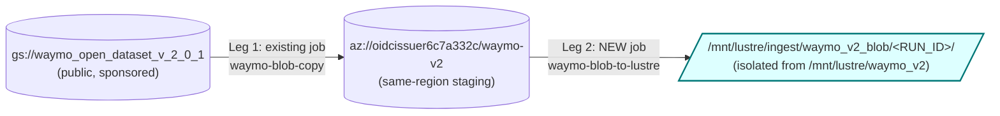
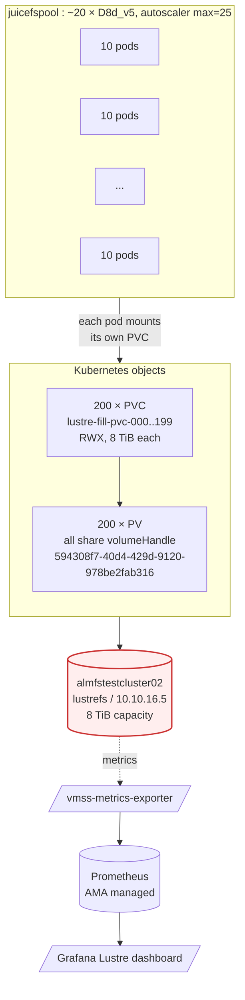

# Azure Managed Lustre — AV simulation pressure test runbook

This runbook is the canonical procedure for pressure-testing an Azure Managed Lustre filesystem from AKS using a realistic **autonomous-vehicle (AV) simulation** workload. It is the single source of truth for the manifests under `deploy/pressure-test/` and the simulator at `scripts/av_lustre_workload.py`.

> **Do not run any phase except discovery against a shared production filesystem without prior approval, a quota guard, and a documented rollback window.**

> **Dataset immutability is a hard rule.** The source dataset at `DATASET_ROOT` (currently `/mnt/lustre/waymo_v2/`, 682.7 GiB / 19,618 files across the four Waymo Open Dataset v2.0.1 splits `training`, `validation`, `testing_location`, `testing`) is read-only for every phase. The simulator, discovery Job, and cleanup Job only ever write under `RESULT_ROOT/<RUN_ID>/<pod-name>/`. The two roots are disjoint by configuration **and** enforced at runtime by a startup preflight and a per-write path gate that aborts the pod if any output resolves under `DATASET_ROOT`.

## 1. Goals and scope

The pressure test answers three questions for AV simulation:

1. **Throughput** — can the filesystem sustain the aggregate read/write bandwidth that N concurrent simulation pods produce against the real dataset?
2. **Tail latency** — does per-file (and per-bucket) p95/p99 latency stay within the AV SLO under sustained pressure, including hotset (shared popular files) reads and cold-cache epochs?
3. **Stability** — does the cluster (CSI driver, exporter, AKS nodes) remain healthy through ramps, sustained load, and burst phases without metric staleness, evictions, or capacity breach?

What this runbook explicitly does **not** validate:

- Source dataset semantics or AV algorithm correctness.
- HSM tiering behavior.
- Production failover / region-pair behavior.
- Destructive fill-to-full tests.

## 2. AV workload model

The simulator is configured to match a typical AV simulation read profile:

| Trait | Real AV simulation | Simulator behavior |
| --- | --- | --- |
| Sensor logs (rosbag/h5/parquet) | Medium–large sequential streaming | `read-pattern: full`, large `CHUNK_SIZE_BYTES`, throughput-oriented |
| Per-frame label / calibration files | Many small open/read/close ops | small bucket reads driven by the real dataset; head-tail pattern is even cheaper if needed |
| Shared maps / models / lookup tables | Same files read by many pods every epoch | `HOTSET_COUNT > 0`; top-K largest files re-read by every pod each epoch |
| Index/metadata lookups | Random seeks inside large files | `read-pattern: random-offset`, configurable `RANDOM_OFFSET_READS` |
| Multi-epoch training-like access | Several passes over the dataset | `EPOCHS > 1`, reshuffled deterministically per epoch |
| Output traces written back | Per-pod derived artifacts | `MODE: read-write-output`, outputs isolated under `RESULT_ROOT/<RUN_ID>/<pod-name>/` |
| Heavy derived-output pipeline | Read real sensor/log shards, write large derived results | `read-write-output` with elevated `OUTPUT_BYTES_PER_INPUT` and `MAX_OUTPUT_BYTES_PER_FILE`; write latency and throughput are reported separately from read latency |

File sizes are classified into buckets so that per-bucket latency is reported and SLO'd independently. Defaults:

| Bucket | Max size | Typical AV content |
| --- | --- | --- |
| `small` | ≤ 1 MiB | Label files, calibration metadata, tiny indexes |
| `medium` | ≤ 64 MiB | Short sensor segments, image batches |
| `large` | ≤ 512 MiB | Rosbag chunks, log shards |
| `xlarge` | > 512 MiB | Long sensor recordings, archive bundles |

> For the current Waymo v2 dataset, expect `medium` and `large` to dominate (Parquet shards typically tens to hundreds of MiB) and `xlarge` to be near-zero. The `discover` mode prints the actual `bucket_counts` / `bucket_bytes`; re-check after every download or dataset refresh before relying on the default SLOs.

## 3. Safety policy

The default policy is to stop before the test filesystem exceeds **80 % used capacity**.

Calculate the allowed output budget before every write-output phase:

```text
safe_write_budget_bytes = capacity_bytes * 0.80 - used_bytes - safety_reserve_bytes
```

Block the phase if the planned output payload exceeds that budget. Use [scripts/lustre_safe_write_budget.py](scripts/lustre_safe_write_budget.py). For capped synthetic writes, estimate payload as `sum(min(input_file_size * OUTPUT_BYTES_PER_INPUT, MAX_OUTPUT_BYTES_PER_FILE)) * epochs_planned`; a low `MAX_OUTPUT_BYTES_PER_FILE` can silently reduce actual writes even when the ratio is high.

Stop a running phase if any of the following occurs:

- projected or observed filesystem usage reaches 80 %;
- available bytes fall below the safety reserve;
- AV pods report source read errors or output write errors;
- per-bucket p95 latency exceeds the agreed SLO and the trend is rising;
- OST or MDT client latency sustained > 5× baseline;
- `rate(azure_managed_lustre_collection_errors_total[5m]) > 0`;
- `time() - azure_managed_lustre_last_success_timestamp_seconds` exceeds the stale threshold;
- AKS nodes report CPU/memory/disk pressure or AV pods repeatedly fail or get evicted.

Output writes are constrained to:

```text
<RESULT_ROOT>/<RUN_ID>/<pod-name>/
```

Cleanup is scoped to `RESULT_ROOT/<RUN_ID>` only and refuses to touch the dataset or anything outside that path.

The simulator additionally enforces three runtime guardrails so a misconfigured `DATASET_ROOT` / `RESULT_ROOT` pair never produces a write into the dataset:

1. **Disjoint-roots preflight** — at startup, `Path.resolve()` is run on both roots and the pod aborts with a clear error if they are equal, if `RESULT_ROOT` is nested inside `DATASET_ROOT`, or if `DATASET_ROOT` is nested inside `RESULT_ROOT`. The check fires in every mode (`discover`, `read-only`, `read-write-output`, `verify-output`).
2. **Per-write path gate** — every output path produced by the simulator must resolve under `RESULT_ROOT/<RUN_ID>/<pod-name>/`; any resolved path whose prefix matches `DATASET_ROOT` (plus separator) is rejected before `open()`.
3. **Dataset-immutability sample** — before launching Phase E (the pressure ramps), capture a 50-file random sample from `DATASET_ROOT` to `reports/<run-base>/dataset-immutability-baseline.tsv` with `(path, size, mtime, sha256-of-first-MiB)`. Re-check the same sample after every phase; any mismatch is a hard abort and indicates a write escape.

## 4. Validated AKS / Lustre / CSI setup

| Item | Value |
| --- | --- |
| AKS cluster | `aks-storage-test` |
| AKS resource group | `aks-test-rg` |
| Lustre filesystem | `lustrenewfile` (`lustrefs`) |
| Lustre resource group | `lustre-rg` |
| Region | `westus3` |
| MGS address | `10.10.16.6` |
| Capacity | `8.0Ti` |
| Static StorageClass | `sc-lustrenewfile-static` |
| Pressure-test PVC | `lustre-pressure-test/lustre-pressure-test-pvc` |
| Dataset path on Lustre | `/mnt/lustre/waymo_v2/` (Waymo Open Dataset v2.0.1) |
| Dataset size / file count | 682.7 GiB / 19,618 files / 4 splits (`training`, `validation`, `testing_location`, `testing`) |
| Validated CSI image | `mcr.microsoft.com/oss/v2/kubernetes-csi/azurelustre-csi:v0.4.0-jammy-3` |
| Validated `LUSTRE_VERSION` | `2.15.7` |
| Validated `CLIENT_SHA_SUFFIX` | `33-g79ddf99` |
| Validated node pool | `juicefspool` (Ubuntu 22.04, kernel `5.15.0-1110-azure`, SKU `Standard_D8d_v5`, 8 vCPU / 32 GiB each) |
| Node count | 2 baseline · ≥ 4 during the pressure window (each node is `Standard_D8d_v5` with ~7 allocatable vCPU; 4 nodes ≈ 28 pod slots at 1 vCPU/pod, 6 nodes ≈ 42 slots for `ramp-40`). If cluster autoscaler is enabled on the pool, change autoscaler `min-count` instead of using `az aks nodepool scale`; see § 8.0. |

The May 20, 2026 run used a newer AMLFS instance, `almfstestcluster02` in `LUSTRE-RG`, with MGS `10.10.16.5`, filesystem name `lustrefs`, SKU `AMLFS-Durable-Premium-500`, capacity `8.0Ti`, and static CSI `volumeHandle` `594308f7-40d4-429d-9120-978be2fab316`. Update [deploy/pressure-test/pvc-example.yaml](deploy/pressure-test/pvc-example.yaml) before each run so the static PV/PVC points at the intended AMLFS instance.

Pressure-test Jobs pin `nodeSelector: kubernetes.azure.com/agentpool: juicefspool`. Azure Linux 3 (`dexpool`) is out of scope until Microsoft publishes a working AMLFS Lustre client for kernel `6.6.130.1-3.azl3`; see the previous test summary captured in `/memories/session/plan.md`.

## 5. Files

| File | Purpose |
| --- | --- |
| [deploy/pressure-test/namespace.yaml](deploy/pressure-test/namespace.yaml) | Dedicated `lustre-pressure-test` namespace. |
| [deploy/pressure-test/pvc-example.yaml](deploy/pressure-test/pvc-example.yaml) | Static StorageClass/PV/PVC for the test filesystem. |
| [deploy/pressure-test/azurelustre-csi-node-rbac.yaml](deploy/pressure-test/azurelustre-csi-node-rbac.yaml) | RBAC for the Azure Lustre CSI node DaemonSet. |
| [deploy/pressure-test/av-workload-configmap.yaml](deploy/pressure-test/av-workload-configmap.yaml) | Knobs ConfigMap + stub script ConfigMap. Includes `WRITE_ONLY_*` keys (§ 15.4). |
| [deploy/pressure-test/av-dataset-discovery-job.yaml](deploy/pressure-test/av-dataset-discovery-job.yaml) | Single-pod read-only dataset profiler. |
| [deploy/pressure-test/av-dataset-validation-job.yaml](deploy/pressure-test/av-dataset-validation-job.yaml) | Indexed pressure-test Job (default parallelism 10). |
| [deploy/pressure-test/av-output-cleanup-job.yaml](deploy/pressure-test/av-output-cleanup-job.yaml) | Scoped cleanup for `RESULT_ROOT/<RUN_ID>` only. |
| [deploy/pressure-test/waymo-download-job.yaml](deploy/pressure-test/waymo-download-job.yaml) | One-shot Job that downloads Waymo Open Dataset v2.0.1 from `gs://waymo_open_dataset_v_2_0_1/` into `/mnt/lustre/waymo_v2/`. **Kept in the repo for reproducibility**, but the Job object and its `gcp-credentials` Secret should be deleted from the cluster after the download completes (see § 13). Never re-run unless the dataset must be replaced. The validated May 20 path used `rclone/rclone:1.69` with OAuth material (`client-id`, `client-secret`, `token.json`); do not run shell `-x` while exporting secrets. |
| [deploy/pressure-test/waymo-blob-copy-job.yaml](deploy/pressure-test/waymo-blob-copy-job.yaml) | Leg 1 of Scenario F (§ 14): GCS → `az:waymo-v2` workload-identity rclone copy. |
| [deploy/pressure-test/waymo-blob-to-lustre-job.yaml](deploy/pressure-test/waymo-blob-to-lustre-job.yaml) | Leg 2 of Scenario F (§ 14): `az:waymo-v2` → `/mnt/lustre/ingest/waymo_v2_blob/<RUN_ID>/`. |
| `deploy/pressure-test/lustre-fill-pvcs.yaml` | Generated 200-PVC fan-out for Scenario G (§ 15). Created on demand by `scripts/gen_lustre_fill_pvcs.py`; not committed in full (template lives in the generator). |
| `deploy/pressure-test/lustre-fill-pvcs-pilot.yaml` | Generated 3-PVC pilot for Scenario G (§ 15.6 step 2). |
| [scripts/av_lustre_workload.py](scripts/av_lustre_workload.py) | AV simulator (modes: `discover`, `read-only`, `read-write-output`, `verify-output`, `write-only`). The `write-only` mode is exercised exclusively by Scenario G. |
| [scripts/av_pressure_phase.sh](scripts/av_pressure_phase.sh) | AV phase driver: patch Job, wait, collect summaries. |
| [scripts/av_blob_to_lustre.sh](scripts/av_blob_to_lustre.sh) | Scenario F helper: render Leg 2 Job, watch rclone, capture summary. |
| [scripts/av_lustre_fill_phase.sh](scripts/av_lustre_fill_phase.sh) | Scenario G helper: apply 200 single-pod fill Jobs, sample Prometheus, aggregate summaries. |
| [scripts/gen_lustre_fill_pvcs.py](scripts/gen_lustre_fill_pvcs.py) | Generator for the 200-PV/PVC fan-out + per-PVC Job manifests (Scenario G). |
| [scripts/lustre_preflight.sh](scripts/lustre_preflight.sh) | Shared pre-flight checks (§ 14.4, § 15.5, § 16.2). Top-level listing, capacity baseline, active-writer detection, dataset immutability presence. |
| [scripts/lustre_safe_write_budget.py](scripts/lustre_safe_write_budget.py) | Local capacity budget calculator (AV ladder). |

## 6. Configuration reference

All knobs are exposed via `ConfigMap/av-lustre-workload-config`. The validation Job reads them through `envFrom`. Override per-phase via `kubectl set env job/av-dataset-validation KEY=VALUE` (or via [scripts/av_pressure_phase.sh](scripts/av_pressure_phase.sh)).

| Key | Default | Effect |
| --- | --- | --- |
| `DATASET_ROOT` | `/mnt/lustre/waymo_v2` | Real AV dataset directory. The disjoint-roots preflight (§ 3) verifies this is not nested with `RESULT_ROOT`. |
| `RESULT_ROOT` | `/mnt/lustre/pressure-tests/av-results` | Where output artifacts go. Must be disjoint from `DATASET_ROOT`; the simulator aborts at startup otherwise. |
| `SPLIT_FILTER` | `` (empty = no filter) | Comma-separated list of first-level directories under `DATASET_ROOT` to descend into (e.g. `training,validation`). Empty walks all children. Used to scope phases. |
| `SUBPATH` | `` (empty = no override) | Relative path under `DATASET_ROOT` that becomes the effective walk root for this phase (e.g. `training/camera_image`). Must not contain `..` or start with `/`; the simulator rejects either. |
| `RUN_ID` | `av-run-001` | One path segment; used in result subpath and as random seed input. |
| `POD_COUNT` | `10` | Sets `parallelism`/`completions`. Override per phase. |
| `FILES_PER_POD` | `0` (no cap) | Cap files processed per pod per epoch. |
| `MAX_BYTES_PER_POD` | `0` (no cap) | Cap bytes read per pod per epoch. |
| `CHUNK_SIZE_BYTES` | `4MiB` | Streaming chunk size and random/head-tail read width. |
| `VERIFY_READS` | `true` | SHA-256 hashing during full reads. Disable for pure throughput phases. |
| `READ_PATTERN` | `full` | `full` \| `random-offset` \| `head-tail`. |
| `RANDOM_OFFSET_READS` | `4` | Random offsets per file when `READ_PATTERN=random-offset`. |
| `EPOCHS` | `1` | Number of shard passes per pod. |
| `WARMUP_SECONDS` | `0` | Latency samples in the first N seconds go into a `warmup_latency_ms` bucket and are excluded from steady-state percentiles. |
| `HOTSET_COUNT` | `0` | Each pod additionally reads the dataset-wide top-K largest files every epoch. |
| `OUTPUT_BYTES_PER_INPUT` | `0.001` | Synthetic output payload size, as a fraction of input bytes. Use `1.0` for the first heavy-write phase so output payload roughly matches input bytes. |
| `MAX_OUTPUT_BYTES_PER_FILE` | `1MiB` | Cap synthetic output payload per input file. Heavy-write phases should raise this with the ratio, for example `512MiB`; otherwise large Waymo shards stay capped at the light-write default. |
| `SMALL_MAX_BYTES`, `MEDIUM_MAX_BYTES`, `LARGE_MAX_BYTES` | `1MiB / 64MiB / 512MiB` | Size-bucket boundaries. |
| `EXCLUDE_PATHS` | `/mnt/lustre/pressure-tests` | Colon-separated paths excluded from enumeration. Do **not** add `DATASET_ROOT` here — reads must traverse it. The metadata-heavy phase extends this list to skip `training/camera_image`, `training/lidar`, and the `*_segmentation` directories. |
| `STATS_INTERVAL_SECONDS` | `30` | Per-pod JSON progress interval. |
| `BUCKET_SLO_P95_MS` | `small=20,medium=300,large=3000,xlarge=8000` | p95 latency SLO per bucket. Defaults are loosened relative to the original runbook because Waymo `medium` files are Parquet shards with per-row-group seeks. |
| `FAIL_ON_SLO` | `false` | When `true`, pods exit with code 4 if any bucket's p95 exceeds its threshold. |
| `FAIL_ON_READ_ERROR` | `true` | First source read error aborts the pod. |
| `FAIL_ON_WRITE_ERROR` | `true` | First output write error aborts the pod. Also fires (exit 3) if any output path resolves under `DATASET_ROOT` — the per-write path gate from § 3. |

### Pod summary schema

Each pod emits one JSON summary on stdout at the end of its run. Key fields:

```json
{
  "event": "summary",
  "pod": "av-dataset-validation-0",
  "pod_index": 0,
  "pod_count": 10,
  "mode": "read-write-output",
  "read_pattern": "full",
  "epochs_completed": 2,
  "warmup_seconds": 60.0,
  "hotset_count": 25,
  "files_attempted": 1234,
  "files_succeeded": 1234,
  "files_failed": 0,
  "bytes_read": 12345678901,
  "bytes_written": 12345678,
 "planned_output_bytes": 12345600,
  "elapsed_seconds": 612.3,
  "throughput_mib_s": 192.7,
 "write_throughput_mib_s": 12.3,
  "per_bucket_counts": {"small": 600, "medium": 400, "large": 200, "xlarge": 34},
  "per_bucket_bytes":  {"small": ...},
  "per_file_latency_ms": {
    "min": 0.3, "p50": 4.2, "p95": 88.0, "p99": 230.1, "max": 540.0, "mean": 17.6,
    "per_bucket": {"small": {"count": 600, "p50": 1.1, "p95": 5.4, "p99": 9.8, "max": 14.2}, ...}
  },
  "warmup_latency_ms": {"count": 312, "p50": 12.8, "p95": 130.0, ...},
 "write_latency_ms": {
    "count": 1234,
    "p50": 4.5,
    "p95": 190.0,
    "p99": 420.0,
    "per_bucket": {"large": {"count": 200, "p95": 900.0, ...}}
 },
  "hotset_latency_ms": {
    "overall": {"count": 50, "p50": 70.0, "p95": 240.0, ...},
    "per_bucket": {"large": {"count": 30, "p50": 80.0, ...}}
  },
  "slo": {
    "pass": true,
    "failures": [],
    "thresholds_ms": {"small": 20, "medium": 300, "large": 3000, "xlarge": 8000},
    "per_bucket": {"small": {"count": 600, "p95_ms": 5.4, "threshold_ms": 20, "pass": true}, ...}
  },
  "errors": []
}
```

Pod exit codes: `0` ok · `1` per-mode failure default · `2` first source read error · `3` first output write error · `4` SLO breach with `FAIL_ON_SLO=true`.

## 7. Phased pressure-test plan

The test is structured as ordered **phases**. Each phase is a dedicated `RUN_ID`, applied via [scripts/av_pressure_phase.sh](scripts/av_pressure_phase.sh). Phases share the same dataset; they differ in concurrency, read pattern, hotset, scope (`--split` / `--subpath`), and epoch settings.

| # | Phase | Pods | Mode | Pattern | Epochs | Hotset | Warmup (s) | Scope (`--split` / `--subpath`) | Goal |
| --: | --- | --: | --- | --- | --: | --: | --: | --- | --- |
| 0 | `baseline` | – | metrics only | – | – | – | – | – | Quiet 30–60 min idle baseline before any phase. |
| 1 | `discovery` | 1 | `discover` | – | – | – | – | – | Profile `DATASET_ROOT`; confirm ≈19,618 files across the four Waymo splits. |
| 2 | `pre-E-immutability` | – | offline | – | – | – | – | – | Capture 50-file `(path, size, mtime, sha256-of-first-MiB)` immutability sample (§ 8.5). |
| 3 | `smoke` | 1 | `read-only` | `full` | 1 | 0 | 0 | `--split training`, `MAX_BYTES_PER_POD=10GiB` | End-to-end smoke on real data; validate filter logic. |
| 4 | `ramp-10-ro` | 10 | `read-only` | `full` | 1 | 0 | 30 | `--split training` | 10-pod baseline; per-bucket p95 + throughput floor. |
| 5 | `ramp-10-rwo` | 10 | `read-write-output` | `full` | 1 | 0 | 30 | `--split training` | Same load with output amplification; capacity-delta check. |
| 6 | `ramp-20` | 20 | `read-write-output` | `full` | 1 | 0 | 60 | `--split training,validation` | First real concurrency stress. |
| 7 | `ramp-40` | 40 | `read-write-output` | `full` | 1 | 0 | 60 | `--split training,validation` | Peak throughput target (requires juicefspool scaled to 6 nodes). |
| 8 | `heavy-write` | 20 | `read-write-output` | `full` | 1 | 0 | 60 | `--split training,validation`, `OUTPUT_BYTES_PER_INPUT=1.0`, `MAX_OUTPUT_BYTES_PER_FILE=512MiB` | Realistic AV derived-output pressure. Target ≈594 GiB payload plus JSON sidecars; collect write latency/throughput without SLO gating first. |
| 9 | `metadata-heavy` | 20 | `read-only` | `full` | 1 | 0 | 60 | `--subpath training`, `EXCLUDE_PATHS` extended to skip `training/camera_image`, `training/lidar`, `training/*_segmentation` | Force the walk onto tiny-file directories (`camera_box`, `camera_calibration`, `camera_hkp`, `camera_to_lidar_box_association`, `stats`, etc.) to stress MDT operations. Tight SLO: `small` p95 ≤ 30 ms. |
| 10 | `hotset` | 20 | `read-only` | `full` | 3 | 50 | 60 | `--subpath training/camera_image` | All pods deterministically re-read the top-50 largest camera_image shards across 3 epochs. Look for warm-cache p95 improvement on epochs 2/3. |
| 11 | `soak` | 20 | `read-write-output` | `full` | 4 | 25 | 120 | `--split training,validation` | Multi-epoch sustained run; tail-latency and leak surface. Gate: epoch-4 p95 ≤ 1.2 × epoch-1 p95. |
| 12 | `cool-down` | – | – | – | – | – | – | – | Watch capacity/latency return toward baseline. |
| 13 | `verify+cleanup` | 1 | `verify-output` then cleanup Job | – | – | – | – | – | Validate outputs, then delete `RESULT_ROOT/<RUN_ID>` per phase. |
| 14 | `report` | – | – | – | – | – | – | – | Produce the structured report (§ 12). |

You can selectively run a subset; phases 0–5 are the minimum recommended after any dataset refresh.

If a phase trips a kill switch (capacity > 80 %, exporter stale, EIO bursts, pod crashes, node pressure, **or** immutability-sample mismatch — see § 11) the sweep stops and the remaining phases are not run until root cause is fixed.

**Scenarios F (§ 14) and G (§ 15) are not on this ladder.** They are standalone, mutually exclusive with each other and with the AV ladder, and have their own pre-flight / cleanup. See § 7.1 below for the supported ordering and combinations.

### 7.1 Ordering and combinations

The runbook supports four entry points against an AMLFS instance. They must execute serially — no two of them may run concurrently against the same filesystem.

| # | Entry point | Touches `/mnt/lustre/waymo_v2/`? | Writes elsewhere? | Destructive? |
| --: | --- | --- | --- | --- |
| A | AV phase ladder (§ 7) | reads only | `/mnt/lustre/pressure-tests/av-results/<RUN_ID>/` | no (80 % cap) |
| B | Scenario F — Blob → Lustre ingest (§ 14) | no | `/mnt/lustre/ingest/waymo_v2_blob/<RUN_ID>/` | no |
| C | Scenario G — 200-client fill-to-ENOSPC (§ 15) | no (path-gate) | `/mnt/lustre/pressure-tests/fill-results/<RUN_ID>/` | **yes** (ENOSPC) |
| D | § 16 final-state cleanup | no (refuses) | removes B & C result roots | no (keep-list enforced) |

Recommended order when combining in a single maintenance window:

1. **A** (AV ladder, if scheduled) — measures filesystem under realistic AV load against the immutable dataset.
2. **B** (Scenario F) — measures Blob → Lustre throughput. **Do not** run during A: rclone `--metadata` writes saturate MDT and skew A's latency.
3. **C** (Scenario G) — destructive; must be the last *measurement* step. Filesystem reaches ENOSPC.
4. **D** (§ 16) — final cleanup; restores the keep-only-`waymo_v2/` invariant.

If only one of {B, C} is run, the other entry remains optional. Order **B → C** is mandatory whenever both are run — C wipes any output left by B (since both share `/mnt/lustre/pressure-tests/` / `/mnt/lustre/ingest/` as result roots that § 16 sweeps).

## 8. Day-of execution

### 8.0 Cluster scaling (before Phase 4)

The ramp phases need pod slots beyond the 2-node baseline of `juicefspool`. Each node is `Standard_D8d_v5` with ~7 allocatable vCPU, so plan node-count by phase:

| Phase | Pods | Min nodes (1 vCPU/pod) |
| --- | --: | --: |
| ramp-10-ro / ramp-10-rwo | 10 | 2 (baseline) |
| ramp-20 | 20 | 3–4 |
| ramp-40 | 40 | 6 |

Scale out before each ramp window and scale back after Phase 14. First check whether cluster autoscaler is enabled on the node pool:

```bash
az aks nodepool show \
   --resource-group aks-test-rg \
   --cluster-name aks-storage-test \
   --name juicefspool \
   --query '{count:count,minCount:minCount,maxCount:maxCount,enableAutoScaling:enableAutoScaling}' \
   -o table
```

If `enableAutoScaling` is `true`, do **not** use `az aks nodepool scale`; AKS rejects manual scale on autoscaler-enabled pools. Raise autoscaler `min-count` instead:

```bash
# Before ramp-20
az aks nodepool update \
   --resource-group aks-test-rg \
   --cluster-name aks-storage-test \
   --name juicefspool \
   --update-cluster-autoscaler \
   --min-count 4 \
   --max-count 20

# Before ramp-40 and the remaining high-pressure phases
az aks nodepool update \
   --resource-group aks-test-rg \
   --cluster-name aks-storage-test \
   --name juicefspool \
   --update-cluster-autoscaler \
   --min-count 6 \
   --max-count 20
```

If autoscaler is disabled, scale the pool directly:

```bash
# Scale out before ramp-40 (use 4 nodes for ramp-20, 6 for ramp-40)
az aks nodepool scale \
   --resource-group aks-test-rg \
   --cluster-name aks-storage-test \
   --name juicefspool \
   --node-count 6

# Wait for new nodes + CSI DaemonSet to converge
kubectl get nodes -l kubernetes.azure.com/agentpool=juicefspool
kubectl rollout status -n kube-system daemonset/csi-azurelustre-node --timeout=300s
kubectl get pods -n kube-system -l app=csi-azurelustre-node -o wide   # expect N Running, 3/3 each
```

After Phase 14 (report), scale back. For autoscaler-enabled pools, restore the baseline minimum and allow AKS to scale down asynchronously:

```bash
az aks nodepool update \
   --resource-group aks-test-rg \
   --cluster-name aks-storage-test \
   --name juicefspool \
   --update-cluster-autoscaler \
   --min-count 2 \
   --max-count 20
```

For autoscaler-disabled pools:

```bash
az aks nodepool scale \
   --resource-group aks-test-rg \
   --cluster-name aks-storage-test \
   --name juicefspool \
   --node-count 2
```

### 8.1 One-time setup

```bash
# Base resources: namespace, RBAC, PVC, ConfigMaps
kubectl apply -k deploy/pressure-test

# Publish the simulator script as a ConfigMap (single source of truth: scripts/av_lustre_workload.py)
make av-workload-script
```

Confirm the Azure Lustre CSI driver is Running on `juicefspool`:

```bash
kubectl get pods -n kube-system -l app=csi-azurelustre-node -o wide
```

### 8.1.1 Recommended: automated full run

Use [scripts/av_pressure_all_phases.sh](../scripts/av_pressure_all_phases.sh) when you want the standard pressure-test ladder without manually launching each phase. It wraps the manual sequence below and performs the safety steps that are easy to miss during a long run:

- applies the pressure-test resources and republishes the simulator script ConfigMap;
- runs discovery and saves `${OUTDIR}/discovery.json`;
- captures a fixed 50-file immutability baseline, then re-checks those exact paths after every phase;
- scales `juicefspool` to the required minimums for `ramp-20`, `ramp-40`, and later high-pressure phases, then scales back on exit unless disabled;
- runs smoke, ramp, heavy-write, metadata-heavy, hotset, strict soak, and soak-collect phases;
- restores `EXCLUDE_PATHS` after metadata-heavy even if a later step fails;
- writes `${OUTDIR}/phase-summary-index.tsv` and `${OUTDIR}/aggregate-summary.json` for reporting.

Default run for `almfstestcluster02` / `aks-storage-test`:

```bash
scripts/av_pressure_all_phases.sh --yes
```

If you already know current filesystem usage, pass it explicitly for the heavy-write capacity guard:

```bash
scripts/av_pressure_all_phases.sh --yes --current-used 1.25TiB
```

If you want to manage AKS scaling yourself, or only validate read-heavy phases:

```bash
scripts/av_pressure_all_phases.sh --yes --skip-scale
scripts/av_pressure_all_phases.sh --yes --skip-heavy-write
```

Useful options:

| Option | Purpose |
| --- | --- |
| `--run-base <id>` | Use a stable run prefix instead of `av-press-<UTC timestamp>`. |
| `--output-dir <dir>` | Save logs, summaries, discovery, immutability checks, and aggregates outside `reports/<run-base>`. |
| `--skip-setup` | Do not apply manifests or republish the workload ConfigMap. |
| `--skip-discovery` | Reuse existing dataset discovery knowledge. |
| `--skip-scale` | Do not call `az aks nodepool`; useful if autoscaler policy is managed separately. |
| `--no-restore-scale` | Leave the nodepool at the high-pressure min/count after the script exits. |
| `--skip-heavy-write` | Skip the ≈600 GiB derived-output phase. |
| `--skip-strict-soak` | Skip the strict `--fail-on-slo` soak and run only the collection soak. |
| `--stop-on-slo` | Stop the full run on read-latency SLO failures instead of recording them and continuing. |

The script treats data errors and immutability changes as hard failures. Read-latency SLO failures are recorded in `phase-summary-index.tsv` and the run continues by default, matching the May 20 findings where data safety passed while intentionally aggressive latency SLOs failed under concurrency. Use `--stop-on-slo` if you want SLO breaches to abort the sweep.

### 8.2 Phase 0 — baseline (30–60 min, no load)

Capture exporter health and Lustre baseline in the **PromQL pack** below. Record values; they become the comparison floor for every later phase.

### 8.3 Phase 1 — discovery

```bash
kubectl delete job -n lustre-pressure-test av-dataset-discovery --ignore-not-found
kubectl apply -f deploy/pressure-test/av-dataset-discovery-job.yaml
kubectl wait -n lustre-pressure-test --for=condition=complete \
   job/av-dataset-discovery --timeout=900s
kubectl logs -n lustre-pressure-test job/av-dataset-discovery \
   | tee reports/av-press-$(date +%Y%m%d)/discovery.json
```

Confirm the JSON profile shows the current Waymo dataset shape:

- `dataset_root` equals `/mnt/lustre/waymo_v2`
- `file_count` between 19,000 and 20,000 (expected ≈ 19,618)
- `directory_count` ≥ 50 (4 splits × ~17 component dirs)
- `bucket_counts.medium` + `bucket_counts.large` > 0
- `bucket_counts.xlarge` is near zero (if `xlarge` > 5 % of bytes, raise `LARGE_MAX_BYTES` to 1024 MiB in the ConfigMap and rerun discovery)

If `DATASET_ROOT` is wrong, update [deploy/pressure-test/av-workload-configmap.yaml](deploy/pressure-test/av-workload-configmap.yaml) and rerun phase 1.

### 8.4 Phase 2 — capture the dataset-immutability sample

Before launching any Phase E run, baseline a fixed 50-file sample of `DATASET_ROOT` for the post-phase immutability re-check. Run this once per `RUN_BASE`.

```bash
RUN_BASE=av-press-$(date +%Y%m%d-%H%M)
mkdir -p reports/${RUN_BASE}
BASELINE=reports/${RUN_BASE}/dataset-immutability-baseline.tsv
POD=av-immutability-baseline-${RUN_BASE}

kubectl run ${POD} --restart=Never \
   --image=alpine:3.20 -n lustre-pressure-test \
   --overrides='{"apiVersion":"v1","spec":{"nodeSelector":{"kubernetes.azure.com/agentpool":"juicefspool"},"restartPolicy":"Never","containers":[{"name":"baseline","image":"alpine:3.20","command":["sh","-c","apk add --no-cache coreutils findutils >/dev/null 2>&1; set -e; find /mnt/lustre/waymo_v2 -type f | shuf -n 50 | while read f; do printf \"%s\\t%s\\t%s\\t\" \"$f\" \"$(stat -c %s \"$f\")\" \"$(stat -c %Y \"$f\")\"; head -c $((1024*1024)) \"$f\" | sha256sum | awk \"{print \\$1}\"; done"],"volumeMounts":[{"name":"lustre","mountPath":"/mnt/lustre"}]}],"volumes":[{"name":"lustre","persistentVolumeClaim":{"claimName":"lustre-pressure-test-pvc"}}]}}'

kubectl wait -n lustre-pressure-test --for=jsonpath='{.status.phase}'=Succeeded pod/${POD} --timeout=900s
kubectl logs -n lustre-pressure-test ${POD} > ${BASELINE}
kubectl delete pod -n lustre-pressure-test ${POD} --ignore-not-found

wc -l ${BASELINE}   # must be 50
```

Re-check after each pressure phase by re-hashing the **same paths** recorded in `${BASELINE}` and `diff`-ing the output against `${BASELINE}`; any non-zero diff is a hard abort (see § 11). Do not call `shuf` again for the re-check, because that can select a different sample and make the comparison meaningless. The automated full-run script handles this by saving the baseline paths into a temporary ConfigMap for each re-check pod.

> Avoid parsing values from `kubectl run --rm` output in automation. The cleanup line (`pod "..." deleted`) can be mixed into stdout and corrupt numeric parsing. For capacity or immutability automation, prefer creating a named pod, waiting for `Succeeded`, reading `kubectl logs`, then deleting the pod.

### 8.5 Phase 3 — smoke + dry runs

```bash
RUN_BASE=av-press-$(date +%Y%m%d-%H%M)
OUTDIR=reports/${RUN_BASE}
SLO="small=20,medium=300,large=3000,xlarge=8000"

# Single-pod smoke on training, 10 GiB cap
scripts/av_pressure_phase.sh --phase smoke --parallelism 1 \
   --run-id ${RUN_BASE}-smoke --mode read-only \
   --read-pattern full --split training \
   --bucket-slo "${SLO}" --output-dir ${OUTDIR}
```

Required outcomes:

- `files_failed: 0`.
- Every output line in pod logs resolves under `${RESULT_ROOT}/${RUN_ID}/<pod-name>/`.
- The immutability sample (§ 8.4) is unchanged after the phase.

### 8.6 Phases 4–11 — pressure ramps

The automated path in § 8.1.1 is preferred for full runs. If you need to debug or rerun one phase manually, use the helper directly. **After every phase**, re-run the exact-path immutability check from § 8.4 and `diff` against the baseline before launching the next phase. Example for the full manual sequence:

```bash
RUN_BASE=av-press-$(date +%Y%m%d-%H%M)
OUTDIR=reports/${RUN_BASE}
SLO="small=20,medium=300,large=3000,xlarge=8000"
META_EXCLUDE="/mnt/lustre/pressure-tests:/mnt/lustre/waymo_v2/training/camera_image:/mnt/lustre/waymo_v2/training/lidar:/mnt/lustre/waymo_v2/training/lidar_segmentation:/mnt/lustre/waymo_v2/training/camera_segmentation"

restore_excludes() {
   kubectl patch configmap -n lustre-pressure-test av-lustre-workload-config \
      --type merge \
      -p '{"data":{"EXCLUDE_PATHS":"/mnt/lustre/pressure-tests"}}' >/dev/null
}
trap restore_excludes EXIT

scripts/av_pressure_phase.sh --phase ramp-10-ro --parallelism 10 \
   --run-id ${RUN_BASE}-ramp-10-ro --mode read-only \
   --read-pattern full --split training \
   --warmup-seconds 30 --bucket-slo "${SLO}" --output-dir ${OUTDIR}

scripts/av_pressure_phase.sh --phase ramp-10-rwo --parallelism 10 \
   --run-id ${RUN_BASE}-ramp-10-rwo --mode read-write-output \
   --read-pattern full --split training \
   --warmup-seconds 30 --bucket-slo "${SLO}" --output-dir ${OUTDIR}

scripts/av_pressure_phase.sh --phase ramp-20 --parallelism 20 \
   --run-id ${RUN_BASE}-ramp-20 --mode read-write-output \
   --read-pattern full --split training,validation \
   --warmup-seconds 60 --bucket-slo "${SLO}" --output-dir ${OUTDIR}

# Requires juicefspool scaled to 6 nodes or autoscaler min-count 6 (§ 8.0)
scripts/av_pressure_phase.sh --phase ramp-40 --parallelism 40 \
   --run-id ${RUN_BASE}-ramp-40 --mode read-write-output \
   --read-pattern full --split training,validation \
   --warmup-seconds 60 --bucket-slo "${SLO}" --output-dir ${OUTDIR}

# Heavy-write: realistic derived-output pressure.
# May 20 discovery/ramp data: training+validation read set ≈593.78 GiB.
# With OUTPUT_BYTES_PER_INPUT=1.0 and MAX_OUTPUT_BYTES_PER_FILE=512MiB,
# target payload is ≈594 GiB plus JSON sidecars. Validate capacity first.
# Set CURRENT_USED to the current filesystem usage from df/Prometheus/Azure metrics,
# for example: CURRENT_USED=1.25TiB
python3 scripts/lustre_safe_write_budget.py \
   --capacity 8.0TiB \
   --used "${CURRENT_USED}" \
   --planned-write 600GiB \
   --reserve 200GiB \
   --max-used-percent 80
scripts/av_pressure_phase.sh --phase heavy-write --parallelism 20 \
   --run-id ${RUN_BASE}-heavy-write --mode read-write-output \
   --read-pattern full --split training,validation \
   --warmup-seconds 60 \
   --output-bytes-per-input 1.0 \
   --max-output-bytes-per-file 512MiB \
   --bucket-slo "small=50,medium=500,large=5000,xlarge=10000" \
   --output-dir ${OUTDIR}

# Metadata-heavy: walk training/, exclude the large directories
PATCH=$(python3 - "${META_EXCLUDE}" <<'PY'
import json, sys
print(json.dumps({'data': {'EXCLUDE_PATHS': sys.argv[1]}}))
PY
)
kubectl patch configmap -n lustre-pressure-test av-lustre-workload-config \
   --type merge -p "${PATCH}" >/dev/null
scripts/av_pressure_phase.sh --phase metadata-heavy --parallelism 20 \
   --run-id ${RUN_BASE}-metadata-heavy --mode read-only \
   --read-pattern full --subpath training \
   --warmup-seconds 60 \
   --bucket-slo "small=30,medium=300,large=3000,xlarge=8000" --output-dir ${OUTDIR}
restore_excludes

scripts/av_pressure_phase.sh --phase hotset --parallelism 20 \
   --run-id ${RUN_BASE}-hotset --mode read-only \
   --read-pattern full --epochs 3 --hotset-count 50 \
   --subpath training/camera_image \
   --warmup-seconds 60 --bucket-slo "${SLO}" --output-dir ${OUTDIR}

scripts/av_pressure_phase.sh --phase soak --parallelism 20 \
   --run-id ${RUN_BASE}-soak --mode read-write-output \
   --read-pattern full --epochs 4 --hotset-count 25 \
   --split training,validation --warmup-seconds 120 \
   --bucket-slo "${SLO}" --fail-on-slo --output-dir ${OUTDIR}

# If the strict gate fails with pod exit code 4, collect a complete metrics run
# without SLO exit gating so all 20 summaries are emitted for analysis.
scripts/av_pressure_phase.sh --phase soak --parallelism 20 \
   --run-id ${RUN_BASE}-soak-collect --mode read-write-output \
   --read-pattern full --epochs 4 --hotset-count 25 \
   --split training,validation --warmup-seconds 120 \
   --bucket-slo "${SLO}" --output-dir ${OUTDIR}
```

The May 20 run showed why this two-step soak pattern is useful: the strict `--fail-on-slo` soak exited with code `4` after only 3 pod summaries, because the Job failed on SLO before all indexed completions finished. The follow-up `soak-collect` run completed all 20 pods and produced the full throughput/latency dataset.

After `heavy-write`, aggregate the write payload before continuing:

```bash
jq -s '[.[].bytes_written] | add' "${OUTDIR}/${RUN_BASE}-heavy-write-heavy-write-summaries.jsonl"
jq -s '[.[].planned_output_bytes] | add' "${OUTDIR}/${RUN_BASE}-heavy-write-heavy-write-summaries.jsonl"
jq -s '[.[].write_throughput_mib_s] | add' "${OUTDIR}/${RUN_BASE}-heavy-write-heavy-write-summaries.jsonl"
jq -s '[.[] | select(.files_failed != 0 or (.errors | length != 0))]' "${OUTDIR}/${RUN_BASE}-heavy-write-heavy-write-summaries.jsonl"
```

The first heavy-write run is a **collection run**, not a strict gate. Keep `--fail-on-slo` off until a write-latency baseline exists, then define write-specific SLOs from `write_latency_ms` and `write_throughput_mib_s`.

Each invocation:

1. Cleans any prior `job/av-dataset-validation`.
2. Renders a fresh Job manifest with `parallelism`/`completions` and env vars (including `SPLIT_FILTER` / `SUBPATH` when `--split` / `--subpath` are passed) before creation. This avoids Kubernetes immutable Job-template patch errors.
3. Waits for completion.
4. Saves pod logs to `${OUTDIR}/<run-id>-<phase>.log`.
5. Extracts per-pod `event=summary` objects to `${OUTDIR}/<run-id>-<phase>-summaries.jsonl`.

### 8.6.1 Reference result: `almfstestcluster02` on May 20, 2026

Use these numbers as sanity checks for the same AMLFS SKU, AKS node pool, and Waymo dataset. They are not universal pass/fail targets.

| Phase | Pods | Files failed | Read GiB | Written GiB | Wall read MiB/s | SLO result |
| --- | ---: | ---: | ---: | ---: | ---: | --- |
| smoke | 1 | 0 | 474.02 | 0.00 | 490.955 | pass |
| ramp-10-ro | 10 | 0 | 474.02 | 0.00 | 3,189.364 | fail: small p95 |
| ramp-10-rwo | 10 | 0 | 474.02 | 0.48 | 2,609.399 | fail: small p95 |
| ramp-20 | 20 | 0 | 593.78 | 0.60 | 3,250.136 | fail: small/medium p95 |
| ramp-40 | 40 | 0 | 593.78 | 0.60 | 4,329.549 | fail: small/medium/large p95 |
| heavy-write | 20 | TBD | ≈593.78 target | ≈594 target | TBD | collection run; first baseline pending |
| metadata-heavy | 20 | 0 | 76.01 | 0.00 | 3,704.738 | no steady-state samples; completed inside warmup |
| hotset | 20 | 0 | 2,124.32 | 0.00 | 3,375.000 | fail: large p95 |
| soak-collect | 20 | 0 | 3,307.58 | 2.39 | 3,345.712 | fail: small/medium p95 |

Interpretation: data correctness and dataset immutability passed across the collected phases (`0` file failures), while the intentionally aggressive latency SLOs failed under concurrency. Treat this as a successful filesystem/data-safety run with SLO tuning or performance investigation follow-up, not as a data-corruption failure.

### 8.7 Phase 13 — verify and cleanup

Verify the outputs (optional, but recommended after a long endurance run):

```bash
kubectl run av-verify --rm -it --restart=Never \
   --image=python:3.12-slim -n lustre-pressure-test \
   --overrides='{"apiVersion":"v1","spec":{"nodeSelector":{"kubernetes.azure.com/agentpool":"juicefspool"},"containers":[{"name":"av-verify","image":"python:3.12-slim","command":["python","/opt/av/av_lustre_workload.py","--mode","verify-output"],"envFrom":[{"configMapRef":{"name":"av-lustre-workload-config"}}],"volumeMounts":[{"name":"lustre","mountPath":"/mnt/lustre"},{"name":"av-script","mountPath":"/opt/av","readOnly":true}]}],"volumes":[{"name":"lustre","persistentVolumeClaim":{"claimName":"lustre-pressure-test-pvc"}},{"name":"av-script","configMap":{"name":"av-lustre-workload-script","defaultMode":493}}]}}'
```

Then clean up per `RUN_ID`:

```bash
kubectl set env -n lustre-pressure-test job/av-output-cleanup --containers=cleanup \
   RUN_ID=<the run id you want to delete>
kubectl apply -f deploy/pressure-test/av-output-cleanup-job.yaml
kubectl wait -n lustre-pressure-test --for=condition=complete \
   job/av-output-cleanup --timeout=900s
kubectl logs -n lustre-pressure-test job/av-output-cleanup
```

The cleanup Job refuses to delete `DATASET_ROOT`, ancestors of `DATASET_ROOT`, or paths outside `RESULT_ROOT`, and it walks for symlink escapes before removing anything.

## 9. PromQL pack

These queries use metric names emitted by [src/vmss_metrics_exporter/collector.py](src/vmss_metrics_exporter/collector.py). Replace `lustrefs` with your filesystem label as needed.

### 9.1 Health

```promql
# Exporter freshness (must stay below the agreed stale threshold during the run)
time() - azure_managed_lustre_last_success_timestamp_seconds

# Exporter collection errors (must remain flat at 0)
rate(azure_managed_lustre_collection_errors_total[5m])

# Exporter collection duration
azure_managed_lustre_collection_duration_seconds

# Discovered filesystems
azure_managed_lustre_filesystem_total
```

### 9.2 Capacity (hard safety boundary)

```promql
# Used % must stay below 80
max by (filesystem_name) (azure_managed_lustre_ost_bytes_used_percent)

# Available % must stay above 20
min by (filesystem_name) (azure_managed_lustre_ost_bytes_available_percent)

# Absolute available bytes
min by (filesystem_name) (azure_managed_lustre_ost_bytes_available)
```

### 9.3 Throughput

```promql
# Aggregate read throughput by filesystem
sum by (filesystem_name) (
  azure_managed_lustre_client_read_throughput_bytes_per_second
)

# Aggregate write throughput by filesystem
sum by (filesystem_name) (
  azure_managed_lustre_client_write_throughput_bytes_per_second
)

# Read ops/s and write ops/s
sum by (filesystem_name) (azure_managed_lustre_client_read_ops)
sum by (filesystem_name) (azure_managed_lustre_client_write_ops)
```

### 9.4 Latency

```promql
# OST client latency by operation
max by (filesystem_name, operation) (
  azure_managed_lustre_ost_client_latency_milliseconds
)

# MDT client latency by operation
max by (filesystem_name, operation) (
  azure_managed_lustre_mdt_client_latency_milliseconds
)
```

### 9.5 MDT pressure

```promql
azure_managed_lustre_mdt_files_used_percent
azure_managed_lustre_mdt_files_free
azure_managed_lustre_hsm_action_errors
azure_managed_lustre_hsm_current_requests
```

### 9.6 AKS scale-out (validation Job at high parallelism)

```promql
azure_vmss_capacity
azure_vmss_instance_count
azure_vmss_exporter_is_leader
```

## 10. Pass / fail criteria

A phase passes when **all** of the following hold:

1. Every pod summary reports `files_failed == 0`.
2. Every pod summary's `slo.pass` is `true` (or the SLO entry is absent for phases without SLO).
3. `max(azure_managed_lustre_ost_bytes_used_percent) < 80` throughout the phase.
4. `time() - azure_managed_lustre_last_success_timestamp_seconds < 180` throughout the phase.
5. `rate(azure_managed_lustre_collection_errors_total[5m]) == 0` throughout the phase.
6. No AKS node went `NotReady` or reported sustained memory/disk pressure.
7. Aggregate read throughput met the per-phase target (recorded against the filesystem SKU envelope).
8. Per-bucket steady-state latency stayed below the agreed SLO:

   | Bucket | Default p95 SLO | Default p99 budget |
   | --- | --: | --: |
   | small  | 20 ms   | 60 ms |
   | medium | 300 ms  | 750 ms |
   | large  | 3 000 ms | 7 500 ms |
   | xlarge | 8 000 ms | 16 000 ms |

   These defaults match `BUCKET_SLO_P95_MS` in the ConfigMap; tune for the actual AV SLO before reporting.

9. **Dataset immutability:** the 50-file sample baselined in § 8.4 hashes identically after the phase (same `size`, `mtime`, and `sha256-of-first-MiB`). Every output path observed in pod logs resolves under `RESULT_ROOT/<RUN_ID>/<pod-name>/` and **never** under `DATASET_ROOT`.

10. **Heavy-write completion:** for `heavy-write`, aggregated `bytes_written` is at least the aggregated `planned_output_bytes` (payload plus JSON sidecars means actual should be slightly higher), `write_latency_ms.count` matches successful source files, and no pod exits with code `3`.

Any single criterion missing => the phase **fails**.

For reporting, separate **data correctness** from **latency SLO**:

- `files_failed == 0` plus a passing immutability diff means the dataset and generated outputs were handled safely.
- `slo.pass == false` means the workload exceeded the configured latency objective. It does not imply read/write corruption.
- In write-heavy phases, `planned_output_bytes` tracks planned binary payload only; `bytes_written` includes JSON sidecars and should be slightly larger.
- With `FAIL_ON_SLO=true`, pods exit `4`. On an Indexed Job with `backoffLimit > 0`, this can produce partial summaries and retries. Use a non-gating `*-collect` run when complete metrics are required.

## 11. Abort and rollback

Stop conditions (any one triggers an immediate abort and a halt to the sweep):

- A criterion in § 10 fails.
- The 50-file dataset-immutability sample shows any mismatch versus `reports/<run-base>/dataset-immutability-baseline.tsv`. **Treat this as a hard abort — it indicates a write escape into `DATASET_ROOT`.** Capture full pod logs and the failing diff before proceeding.
- The simulator emits the disjoint-roots preflight error or the per-write path-gate error (exit code 3). Inspect `DATASET_ROOT` / `RESULT_ROOT` in the ConfigMap before retrying.
- Capacity exceeds 80 %, exporter metrics go stale, or AKS nodes go `NotReady`.

If any stop condition fires:

1. **Immediately cancel** the in-flight Job:
   ```bash
   kubectl delete job -n lustre-pressure-test av-dataset-validation
   ```
2. **Check capacity recovery** with `azure_managed_lustre_ost_bytes_used_percent`. If usage is climbing, do not run a new phase — run cleanup first.
3. **Run scoped cleanup** for the current `RUN_ID` using phase 13.
4. **Collect forensics**:
   ```bash
   kubectl get events -n lustre-pressure-test --sort-by=.lastTimestamp | tail -100
   kubectl describe pods -n lustre-pressure-test -l app.kubernetes.io/name=av-lustre-workload
   kubectl logs  -n kube-system -l app=csi-azurelustre-node --tail=400
   ```
5. **Pause further phases** until the abort cause is documented and fixed.

Cluster-level rollback (cluster left healthy) is the validated Ubuntu `juicefspool` configuration documented in § 4.

## 12. Report template

Create the report at `reports/av-press-<run-base>.md` after each full run. Required sections:

```markdown
# AV Lustre Pressure Test — <RUN_BASE>

## Run metadata
- Run base ID
- Date (UTC)
- Filesystem name, region, SKU, capacity
- AKS cluster, node pool, node count, node SKU
- CSI image, LUSTRE_VERSION, CLIENT_SHA_SUFFIX
- Operator(s), reviewer(s)

## Dataset profile (from phase 1)
- Dataset root
- File count, directory count, total bytes
- Bucket counts and bytes
- Top-10 largest files (size + redacted path)

## Phase results
| Phase | Pods | Mode | Pattern | Epochs | Hotset | Warmup | Files OK / Failed | Read MiB/s (sum) | Write MiB/s (sum) | Planned / actual write GiB | p95 read small/med/large (ms) | p95 write small/med/large (ms) | SLO | Result |
| --- | --: | --- | --- | --: | --: | --: | --- | --: | --: | --- | --- | --- | --- | --- |
| steady-10 | 10 | rwo | full | 1 | 0 | 60 | 12340 / 0 | 1180 | 12 | 0.7 / 0.7 | 4.2 / 88 / 1280 | 1.2 / 40 / 700 | pass | PASS |
| ramp-20   | 20 | rwo | full | 1 | 0 | 60 | ... | ... | ... | ... | ... | ... | ... | ... |
| ramp-40   | 40 | rwo | full | 1 | 0 | 60 | ... | ... | ... | ... | ... | ... | ... | ... |
| heavy-write | 20 | rwo | full | 1 | 0 | 60 | ... | ... | ... | 594 / 594+ | ... | ... | collect | ... |
| metadata-storm | 20 | ro | head-tail | 1 | 0 | 60 | ... | ... | – | – | ... | – | – | ... |
| index-lookup   | 20 | ro | random-offset | 1 | 0 | 60 | ... | ... | – | – | ... | – | – | ... |
| hotset    | 20 | ro | full | 2 | 25 | 60 | ... | ... | – | – | ... | – | – | ... |
| endurance | 10 | rwo | full | 4 | 25 | 120 | ... | ... | ... | ... | ... | ... | ... | ... |

## Capacity and exporter health
- Start / peak / end values of `azure_managed_lustre_ost_bytes_used_percent`
- Max `time() - azure_managed_lustre_last_success_timestamp_seconds`
- Cumulative `azure_managed_lustre_collection_errors_total` delta

## Dataset immutability
- 50-file baseline location: `reports/<RUN_BASE>/dataset-immutability-baseline.tsv`
- Per-phase re-check result (pass / fail + first mismatching path if any)

## Issues, observations, next actions
- ...

## Cleanup
- Run ID(s) cleaned up
- Post-cleanup `azure_managed_lustre_ost_bytes_used_percent`
- Node pool restored to baseline: autoscaler `min-count=2` if autoscaler is enabled, or `node-count=2` if autoscaler is disabled

## Scenario F — Blob → Lustre ingest (if run)
- Use the row template from § 14.10. Aggregate one row per Scenario F invocation in this section.

## Scenario G — 200-client fill-to-ENOSPC (if run)
- Use the row template from § 15.10. One section per Scenario G invocation.

## Final filesystem state (§ 16, if run)
- Use the row template from § 16.5.
```

Use [reports/uae-lustre-24h-analysis-2026-05-19.md](reports/uae-lustre-24h-analysis-2026-05-19.md) as the narrative style reference.

## 13. Post-run cleanup

Run these once the report is finalized. They restore the cluster to its pre-test state without touching `DATASET_ROOT`. After the per-`RUN_ID` cleanups below, **and once no further scenarios will run against this filesystem**, run the final-state cleanup in § 16 to enforce the keep-only-`/mnt/lustre/waymo_v2/` invariant.

```bash
# 1. Per-RUN_ID result trees (one invocation per RUN_ID you want removed)
kubectl set env -n lustre-pressure-test job/av-output-cleanup --containers=cleanup RUN_ID=<run-id>
kubectl apply -f deploy/pressure-test/av-output-cleanup-job.yaml
kubectl wait -n lustre-pressure-test --for=condition=complete job/av-output-cleanup --timeout=900s

# 2. Drop the Waymo download Job from the cluster (the YAML stays in the repo)
kubectl delete job -n lustre-pressure-test waymo-dataset-download --ignore-not-found

# 3. Delete the GCP credentials Secret — it is only needed during a download window
kubectl delete secret -n lustre-pressure-test gcp-credentials --ignore-not-found

# 4. Scale juicefspool back to its baseline size.
# If autoscaler is enabled, restore min-count and let AKS scale down asynchronously:
az aks nodepool update \
   --resource-group aks-test-rg \
   --cluster-name aks-storage-test \
   --name juicefspool \
   --update-cluster-autoscaler \
   --min-count 2 \
   --max-count 20

# If autoscaler is disabled, use direct node-count scaling instead:
az aks nodepool scale \
   --resource-group aks-test-rg \
   --cluster-name aks-storage-test \
   --name juicefspool \
   --node-count 2
```

[deploy/pressure-test/waymo-download-job.yaml](deploy/pressure-test/waymo-download-job.yaml) is **kept in the repo** for reproducibility. The validated May 20 manifest uses rclone OAuth material in the `gcp-credentials` Secret (`client-id`, `client-secret`, `token.json`). If you switch back to an ADC-based flow, document the new required key names here before running. Never run the download Job unless the dataset must be replaced — a stray re-run could overwrite `/mnt/lustre/waymo_v2/`.

---

## 14. Scenario F — Tiered ingest via Azure Blob staging

This is a **standalone scenario** (not part of the phase ladder in § 7). It characterizes the **two-leg ingest pipeline** in which the AV dataset is first staged in an Azure Blob container, then pulled into Lustre. It complements the direct GCS → Lustre path in [deploy/pressure-test/waymo-download-job.yaml](deploy/pressure-test/waymo-download-job.yaml) by isolating each leg so that the Blob → Lustre client-side ingest throughput can be measured independently of cross-cloud bandwidth.

### 14.1 Goal and rationale

1. **Decouple cross-cloud cost/latency from Lustre client ingest.** GCS → Azure Blob is a one-time, free same-region path; Blob → Lustre exercises the AKS workload identity + Lustre client write path that production batch jobs would actually use.
2. **Provide a reproducible re-hydration path.** Once `az:waymo-v2` is populated, the Lustre filesystem can be re-hydrated in minutes (same-region Blob → Lustre is ~10–30× the cross-cloud GCS → Lustre throughput) without re-touching the public Waymo bucket.
3. **Establish a Blob → Lustre throughput baseline** for comparison against other Lustre SKUs, AKS node SKUs, and rclone tunings.

### 14.2 Architecture



Leg 1 (GCS → Blob) is **already implemented** in [deploy/pressure-test/waymo-blob-copy-job.yaml](deploy/pressure-test/waymo-blob-copy-job.yaml). Leg 2 is the new artifact this scenario introduces.

### 14.3 Prerequisites

| Asset | State | Notes |
| --- | --- | --- |
| Azure Storage account `oidcissuer6c7a332c` | exists | container `waymo-v2` is the staging destination. |
| User-assigned MI `mi-waymo-copy` (clientId `ab01bc3e-e8da-40fa-b9b8-43e527612a18`) | exists, federated to `lustre-pressure-test/waymo-copy` SA | already has **Storage Blob Data Contributor** on container `waymo-v2` only (sub-scope). Read covers both directions; no extra RBAC needed for Leg 2. |
| Secret `lustre-pressure-test/gcp-credentials` | required only for Leg 1 | not consumed by Leg 2. After Leg 2 starts, the Secret can be removed (§ 13 step 3). |
| PVC `lustre-pressure-test/lustre-pressure-test-pvc` | Bound, 8 TiB, RWX, sc `sc-almfstestcluster02-static` | shared with the AV phase ladder. Capacity headroom for Leg 2 ≈ container size of `az:waymo-v2` (≈683 GiB once Leg 1 completes). |
| Node pool `juicefspool` | ≥ 1 node Ready | Leg 2 runs a single pod; node count irrelevant beyond 1. |
| CSI DaemonSet `csi-azurelustre-node` | Running on the selected node | unchanged from § 4. |

### 14.4 Pre-flight checks

Run before Leg 2. The first check anchors against Leg 1's reported byte count so a partial Leg 1 cannot silently feed a partial Leg 2.

```bash
# 0. No other Lustre writer is active. Scenario F's measurement run must not
#    overlap the AV phase ladder or Scenario G — each would skew the other's
#    throughput and saturate the MDT (rclone --metadata is metadata-heavy).
bash scripts/lustre_preflight.sh --check active-writers \
   || { echo "ABORT: other writers active"; exit 1; }

# 1. Leg 1 is complete AND its reported byte count matches the staging container.
#    Source LEG1_BYTES from the Leg 1 report (reports/<leg1-run-id>/blob-copy-summary.txt
#    field 'transferred_bytes'). Refuse to proceed if rclone size diverges > 0.5 %.
export LEG1_BYTES="${LEG1_BYTES:?must export LEG1_BYTES from Leg 1 report}"
kubectl run rclone-check --rm -it --restart=Never \
   -n lustre-pressure-test \
   --image=rclone/rclone:1.69 \
   --serviceaccount=waymo-copy \
   --overrides='{"apiVersion":"v1","spec":{"serviceAccountName":"waymo-copy","containers":[{"name":"rclone-check","image":"rclone/rclone:1.69","env":[{"name":"RCLONE_CONFIG_AZ_TYPE","value":"azureblob"},{"name":"RCLONE_CONFIG_AZ_ACCOUNT","value":"oidcissuer6c7a332c"},{"name":"RCLONE_CONFIG_AZ_USE_AZUREAD","value":"true"},{"name":"RCLONE_CONFIG_AZ_ENV_AUTH","value":"true"}],"command":["rclone","size","az:waymo-v2","--json"]}]}}' \
   --labels=azure.workload.identity/use=true \
   > /tmp/leg1-size.json
CURRENT_BYTES=$(jq -r '.bytes' /tmp/leg1-size.json)
python3 -c "import sys; e=int('${LEG1_BYTES}'); c=int('${CURRENT_BYTES}'); d=abs(c-e)/e; print(f'expected={e} current={c} delta={d:.4%}'); sys.exit(0 if d<0.005 else 2)" \
   || { echo "ABORT: Leg 1 byte count mismatch > 0.5 %"; exit 1; }

# 2. Lustre has headroom for the new directory.
#    Required: ost_bytes_used_percent + (container_bytes / capacity) < 80.
kubectl exec -n default deploy/vmss-metrics-exporter -- \
   curl -s http://localhost:8000/metrics \
   | grep 'azure_managed_lustre_ost_bytes_used_percent{filesystem_name="almfstestcluster02"}'

# 3. The destination directory is NOT under /mnt/lustre/waymo_v2/.
#    The Leg 2 job's command-line guard already enforces this; the
#    check below is a defence-in-depth dry run.
test "$DEST" = "/mnt/lustre/ingest/waymo_v2_blob/${RUN_ID}" \
   && echo "OK: destination isolated from DATASET_ROOT" \
   || { echo "ABORT: DEST collides with DATASET_ROOT"; exit 1; }
```

### 14.5 Procedure

Leg 2 is driven by a new sibling helper [scripts/av_blob_to_lustre.sh](scripts/av_blob_to_lustre.sh) that renders a Job manifest from [deploy/pressure-test/waymo-blob-to-lustre-job.yaml](deploy/pressure-test/waymo-blob-to-lustre-job.yaml) with the requested `RUN_ID`, applies it, and tails the rclone output.

```bash
# Set a unique RUN_ID per ingest run (timestamp-based, matches reports/ convention).
RUN_ID="blob-ingest-$(date -u +%Y%m%d-%H%M)"

# Optional: limit scope to a sub-prefix (smoke test before a full re-hydrate).
#   --source-suffix testing       # ≈ 9.5 GiB
#   --source-suffix validation    # ≈ 120 GiB
# Omit --source-suffix for a full container copy.

bash scripts/av_blob_to_lustre.sh \
   --run-id "${RUN_ID}" \
   --source-suffix testing \
   --output-dir "reports/${RUN_ID}"

# Full-container re-hydrate (production-shape run):
bash scripts/av_blob_to_lustre.sh \
   --run-id "${RUN_ID}" \
   --output-dir "reports/${RUN_ID}" \
   --timeout 6h
```

Internals: the Job mounts `lustre-pressure-test-pvc` at `/mnt/lustre`, runs `rclone/rclone:1.69`, and uses workload-identity (`RCLONE_CONFIG_AZ_USE_AZUREAD=true`, `RCLONE_CONFIG_AZ_ENV_AUTH=true`) — identical auth shape to [deploy/pressure-test/waymo-blob-copy-job.yaml](deploy/pressure-test/waymo-blob-copy-job.yaml). The container command does, in order:

1. Resolve `DEST=/mnt/lustre/ingest/waymo_v2_blob/${RUN_ID}`.
2. Refuse to proceed if `realpath -m "${DEST}"` is `/mnt/lustre/waymo_v2` or has it as an ancestor (immutability guard).
3. `mkdir -p "${DEST}"`.
4. `rclone size az:waymo-v2[/${SOURCE_SUFFIX}]` smoke test.
5. `df -h /mnt/lustre` before, `du -sh "${DEST}"` (expected empty unless resuming — see below).
6. `rclone copy az:waymo-v2[/${SOURCE_SUFFIX}] "${DEST}" --fast-list --metadata --progress --stats=30s --stats-one-line`.
7. `df -h /mnt/lustre` after, `du -sh "${DEST}"`.

**Tunings.** Defaults match the existing copy job: `RCLONE_TRANSFERS=32`, `RCLONE_CHECKERS=16`, `RCLONE_BUFFER_SIZE=32M`. The helper accepts `--transfers N --checkers N --buffer-size SIZE` to override.

**Throughput sweep (optional, recommended for a fresh baseline).** Run the same `SOURCE_SUFFIX=validation` (≈ 120 GiB) at four parallelism levels and record the curve. Each sweep point is one Scenario F invocation with a distinct `RUN_ID`:

```bash
for T in 16 32 64 128; do
   bash scripts/av_blob_to_lustre.sh \
      --run-id "blob-sweep-T${T}-$(date -u +%Y%m%d-%H%M)" \
      --source-suffix validation \
      --transfers "${T}" \
      --output-dir "reports/blob-sweep-T${T}"
   # Allow OST writeback to drain and capacity to recover before next point.
   sleep 120
done
```

Report the four `Avg MiB/s` numbers as a small table; the knee usually appears at `T=32` or `T=64` for D8d_v5 nodes.

**Resumability.** rclone `copy` is idempotent: re-running with the *same* `DEST` skips files whose size+mtime match. Because the helper bakes `RUN_ID` into `DEST`, resumption after a partial run requires **reusing the same `RUN_ID`** — pass `--run-id <previous-id>` rather than generating a fresh one. The helper detects an existing `DEST` and prints `RESUMING: <bytes> already present` before kicking rclone. A new `RUN_ID` re-copies from scratch (slow but correct).

**`--metadata` semantics.** rclone preserves blob `mtime` as the Lustre file `mtime` and the blob's `Content-Type` as an xattr. It does **not** preserve etag, lease state, or blob index tags. The Lustre file's raw bytes are identical to the blob's raw payload; `du -sh` may differ from `rclone size` because `du` counts Lustre stripe-aligned allocation while `rclone size` reports raw `Content-Length`. The pass-criterion in § 14.7 uses raw-bytes-from-`find` to make the comparison apples-to-apples.

**Staging container retention.** After the runbook closes, `az:waymo-v2` is **kept** as the canonical re-hydration source. To tear it down explicitly (rarely needed):

```bash
az storage container delete \
   --account-name oidcissuer6c7a332c \
   --name waymo-v2 \
   --auth-mode login
# Re-creating it requires re-running waymo-blob-copy-job.yaml (Leg 1).
```

### 14.6 Monitoring and observability

Watch the existing Grafana Lustre dashboard during the run; the relevant panels are:

- **Aggregate write throughput** — `sum by (filesystem_name) (azure_managed_lustre_client_write_throughput_bytes_per_second)`. Expect a flat plateau matching the rclone live stats line.
- **OST capacity** — `max by (filesystem_name) (azure_managed_lustre_ost_bytes_used_percent)`. Should climb monotonically from baseline to `baseline + container_size / capacity`.
- **MDT client latency** (small-file create rate) — `azure_managed_lustre_mdt_client_latency_milliseconds{operation="create"}`. Look for sustained spikes that would indicate MDT saturation.
- **Pod logs** — rclone emits one-line stats every 30 s: bytes transferred, throughput, ETA. The phase helper streams these to `reports/<RUN_ID>/blob-ingest-<RUN_ID>.log`.

A throughput-only run record goes to `reports/<RUN_ID>/blob-ingest-<RUN_ID>-summary.txt` with: start time, end time, total objects, total bytes, average throughput, peak throughput, final `du -sh "${DEST}"`, and final `azure_managed_lustre_ost_bytes_used_percent`.

### 14.7 Pass / fail criteria

Scenario F passes when all of the following hold:

1. The Job's pod exits `0` and the Job reaches `Complete=True`.
2. **Raw-bytes equality**: `find "${DEST}" -type f -printf '%s\n' | awk '{s+=$1}END{print s}'` matches `rclone size az:waymo-v2[/${SOURCE_SUFFIX}] --json | jq -r '.bytes'` to within ± 0.01 % (raw payload bytes; not `du -sh`, which reports Lustre stripe-aligned allocation).
3. **File count equality**: `find "${DEST}" -type f | wc -l` matches `rclone size --json | jq -r '.count'`.
4. `azure_managed_lustre_ost_bytes_used_percent` peak during the run stayed `< 80`.
5. `time() - azure_managed_lustre_last_success_timestamp_seconds < 180` throughout the run.
6. The 50-file dataset-immutability sample (§ 8.5) re-hashes identically — proves nothing in Leg 2 touched `/mnt/lustre/waymo_v2/`.
7. No CSI DaemonSet pod restarted during the run.

The throughput numbers are **observed**, not gated, on the first run; record them in the report as baseline. After two passing runs at the same `RCLONE_TRANSFERS`, the observed `Avg MiB/s` can be promoted to a regression SLO (e.g. ≥ 800 MiB/s sustained for the full container on `juicefspool` D8d_v5 at `T=32`).

### 14.8 Abort conditions

Abort and clean up if any of the following fires:

- Pod exits `1` with `ERROR: DEST is inside /mnt/lustre/waymo_v2` — the helper resolved `DEST` incorrectly. Inspect environment, do not retry until fixed.
- `azure_managed_lustre_ost_bytes_used_percent > 80` — capacity guard. Stop the Job and run the cleanup step (§ 14.9) before any retry.
- rclone reports `>10` consecutive transfer errors. Capture the rclone log and the workload-identity token-exchange events (`kubectl get events -n lustre-pressure-test --field-selector reason=FailedMount,Unhealthy`).
- The dataset-immutability re-hash mismatches. **Hard abort** — investigate before any further Lustre write activity.

### 14.9 Cleanup

Per-`RUN_ID` cleanup (run after each Scenario F invocation):

```bash
# Delete only the Leg-2 ingest tree for this RUN_ID. Re-uses the cleanup Job's
# safety logic: refuses paths under /mnt/lustre/waymo_v2/ and refuses ancestors
# of DATASET_ROOT.
kubectl set env -n lustre-pressure-test job/av-output-cleanup --containers=cleanup \
   RUN_ID="${RUN_ID}" \
   RESULT_ROOT=/mnt/lustre/ingest/waymo_v2_blob
kubectl apply -f deploy/pressure-test/av-output-cleanup-job.yaml
kubectl wait -n lustre-pressure-test --for=condition=complete \
   job/av-output-cleanup --timeout=1800s
kubectl logs -n lustre-pressure-test job/av-output-cleanup

# Optional: delete the Leg-2 Job itself once logs are archived.
kubectl delete job -n lustre-pressure-test waymo-blob-to-lustre --ignore-not-found
```

When Scenario F is the **last** scenario run against this filesystem, follow up with the final-state cleanup in § 16 to remove `/mnt/lustre/ingest/` wholesale (covers any stray per-`RUN_ID` trees that may have been skipped).

### 14.10 Report row template

Append a Scenario F entry to the run's `reports/<RUN_BASE>.md`:

```markdown
## Scenario F — Blob → Lustre ingest (<RUN_ID>)
- Source: `az:waymo-v2[/<suffix>]`, <object count> objects, <bytes> GiB
- Destination: `/mnt/lustre/ingest/waymo_v2_blob/<RUN_ID>/`
- rclone tunings: TRANSFERS=<n>, CHECKERS=<n>, BUFFER_SIZE=<size>
- Start (UTC) | End (UTC) | Wall-clock | Avg MiB/s | Peak MiB/s
- Final `du -sh` vs `rclone size`: <delta %>
- OST used % at start / peak / end
- MDT p95 create latency at steady-state
- Dataset immutability re-check: pass / fail
- Issues, follow-ups
```

### 14.11 Risks and mitigations

| Risk | Likelihood | Impact | Mitigation |
| --- | --- | --- | --- |
| `DEST` resolves under `DATASET_ROOT` due to env mis-set | low | dataset overwrite (critical) | Container-level guard + post-run immutability re-hash gate the run. |
| rclone `--metadata` writes excessive `mtime`/`xattr` calls and saturates MDT | medium | tail-latency cliff on AV phases that run concurrently | Schedule Scenario F outside the AV phase ladder; do not run concurrently with Phase 9 (`metadata-heavy`). |
| Workload-identity token expires mid-copy (long runs) | low | rclone 401s, Job retries | Default federated-token refresh window is 1 h; rclone re-reads `AZURE_FEDERATED_TOKEN_FILE` each request via DAC. `--retries 3` (rclone default) tolerates transient 401s. |
| Same-region Blob → Lustre exceeds the configured AMLFS write SKU envelope | low | sustained backpressure, no data loss | Cap `RCLONE_TRANSFERS` to 32 on the validated SKU (matches existing copy job); raise only with a tested capacity envelope. |
| Container `waymo-v2` is partially populated when Leg 2 starts | medium | Leg 2 finishes with `<` expected bytes | Pre-flight `rclone size az:waymo-v2` and compare against the Leg 1 run's report before kicking Leg 2. |

---

## 15. Scenario G — 200-client fill-to-ENOSPC

This is a **destructive standalone scenario** that intentionally fills `almfstestcluster02` until at least one OST returns `ENOSPC`. It characterizes the 200-client concurrent-write blast radius, the tail-latency cliff approaching capacity, the per-OST imbalance at high fill, and the recovery time after a scoped cleanup. **Do not run against any filesystem that holds production-relevant data.**

> Scenario G is **not** subject to the 80 % capacity kill switch used by the AV phase ladder. ENOSPC is treated as a **successful** terminal condition.

### 15.1 Goal and rationale

1. **Quantify the 200-client write fan-out** — sustained aggregate write throughput, per-client p95/p99 write latency, MDT create rate under 200-client load.
2. **Map the tail-latency cliff** — identify the `ost_bytes_used_percent` threshold at which p99 write latency rises sharply (typically 90–95 %).
3. **Exercise ENOSPC handling end-to-end** — verify that client-side `OSError(ENOSPC)` propagates cleanly, that the workload terminates gracefully, and that the filesystem is recoverable via scoped cleanup without operator intervention beyond `lfs migrate` if OST imbalance persists.
4. **Validate the multi-PVC fan-out pattern** — confirm that 200 distinct PVCs can be bound to the same Azure Managed Lustre filesystem via 200 PVs sharing the same `volumeHandle`, which is the foundation for any future per-pod-PVC training topology.

### 15.2 Architecture



Key invariants:

- **One filesystem.** All 200 PVCs are backed by the same `almfstestcluster02` AMLFS via 200 distinct PV objects that share `volumeHandle: 594308f7-40d4-429d-9120-978be2fab316`. The PV/PVC names differ; the underlying mount target is identical.
- **Per-pod result tree.** Each pod writes only to `/mnt/lustre/pressure-tests/fill-results/<RUN_ID>/<pod-name>/`. Different PVCs map to the same shared Lustre namespace, so this per-pod prefix is what guarantees write isolation — not the PVC name.
- **No reads from `DATASET_ROOT`.** A new `write-only` mode in `av_lustre_workload.py` (see § 15.4) synthesizes payload entirely from in-process pseudorandom bytes and never walks `/mnt/lustre/waymo_v2/`. The three immutability guardrails (`assert_disjoint_roots()`, `ensure_within()`, `FAIL_ON_WRITE_ERROR`) remain active.

### 15.3 Prerequisites

| Asset | State | Notes |
| --- | --- | --- |
| AMLFS `almfstestcluster02` | dedicated to this scenario | **must not** hold the production dataset. If `/mnt/lustre/waymo_v2/` is present, an immutability sample must exist before Scenario G runs (§ 15.5). |
| 200 PVs + 200 PVCs | apply on demand | Generated by `scripts/gen_lustre_fill_pvcs.py` from a single PV/PVC template that mirrors [deploy/pressure-test/pvc-example.yaml](deploy/pressure-test/pvc-example.yaml). Names: `pv-almfstestcluster02-fill-NNN` and `lustre-fill-pvc-NNN` for `NNN = 000..199`. |
| Node pool `juicefspool` | autoscaler `max-count ≥ 25` | Single command in § 15.6 step 1 raises the cap; revert in cleanup. |
| ConfigMap `av-lustre-workload-script` | populated with `scripts/av_lustre_workload.py` content that includes the new `write-only` mode | See § 15.4. |
| ConfigMap `av-lustre-workload-config` | augmented with `WRITE_ONLY_*` keys | See § 15.4. |
| Grafana Lustre dashboard, AMA Prometheus, [deploy/lustre-alert-rules.yaml](deploy/lustre-alert-rules.yaml) | already installed | No new dashboards or alert rules are added. |

### 15.4 Workload — new `write-only` mode

A new `write-only` mode is added to [scripts/av_lustre_workload.py](scripts/av_lustre_workload.py). It:

- Does **not** walk `DATASET_ROOT`; it does not read any input file.
- Synthesizes per-file payload from a **deterministic** pod-scoped `random.Random(seed=int.from_bytes(hashlib.sha256(POD_NAME.encode()).digest()[:8], 'big'))`. (Python's built-in `hash()` is salted per interpreter since 3.3; the SHA-256 seed is reproducible across runs.) The generator advances once per chunk — never re-seeded per file — so the same chunk bytes are not emitted twice, which defeats any defensive OST de-dup or compression heuristics.
- Loops file creation into `RESULT_ROOT/<RUN_ID>/<pod-name>/dir-NNNN/file-MMMMM.bin` (round-robin over `WRITE_ONLY_DIR_FANOUT` subdirs to spread MDT load).
- Treats **`OSError(errno == ENOSPC)` as terminal-success**: the pod logs the event, emits a final summary with `terminal_reason="enospc"` and `enospc_reached=true`, then exits `0`. Without this special case, every pod would exit non-zero on ENOSPC and the Job would be marked `Failed`.
- Installs a `SIGTERM` / `SIGINT` handler that flushes the summary JSONL line and then exits `0` with `terminal_reason="sigterm"`. The handler must complete summary emission within the pod's `terminationGracePeriodSeconds` (default 30 s); otherwise the operator loses the partial-run summary. Aggregators count `sigterm` pods toward the run total.
- Drops latency / throughput samples collected during the first `WARMUP_SECONDS` to keep CSI mount-cold-start outliers out of the per-pod p95/p99 stats. Reuses the existing `WARMUP_SECONDS` config key from § 6.
- Terminates with `terminal_reason ∈ { "enospc", "target_bytes", "files_per_pod", "sigterm", "completed" }`.

New ConfigMap keys (added to [deploy/pressure-test/av-workload-configmap.yaml](deploy/pressure-test/av-workload-configmap.yaml)):

| Key | Default | Meaning |
| --- | --- | --- |
| `WRITE_ONLY_FILE_SIZE_BYTES` | `64MiB` | Per-file size. |
| `WRITE_ONLY_TARGET_BYTES_PER_POD` | `0` | Stop after this many bytes written. `0` = unbounded; loop until ENOSPC or SIGTERM. |
| `WRITE_ONLY_DIR_FANOUT` | `1024` | Number of subdirectories per pod; round-robin assignment. |
| `WRITE_ONLY_CHUNK_SIZE_BYTES` | `4MiB` | Write buffer size (reuses `CHUNK_SIZE_BYTES` if unset). |

Existing keys reused: `MODE` (set to `write-only`), `POD_NAME`, `POD_COUNT`, `RESULT_ROOT`, `RUN_ID`, `FAIL_ON_WRITE_ERROR` (kept `true` for non-ENOSPC errors), `STATS_INTERVAL_SECONDS`, `MAX_RECORDED_ERRORS`, `WARMUP_SECONDS` (recommended `30` for Scenario G).

Pod summary schema additions (compatible with § 6 — only new fields are added):

```json
{
   "event": "summary",
   "mode": "write-only",
   "pod": "lustre-fill-NNN-...",
   "files_written": 1234,
   "bytes_written": 81604378624,
   "write_latency_ms": { "p50": 18, "p95": 92, "p99": 410 },
   "write_throughput_mib_s": { "p50": 31.2, "p95": 12.7 },
   "warmup_dropped_samples": 47,
   "enospc_reached": true,
   "terminal_reason": "enospc"
}
```

**Future work (not in scope for this scenario).** Per-pod throughput could be pushed to a Prometheus pushgateway in real time, letting the Grafana dashboard show per-pod variance live without parsing JSONL. Pushgateway is *not* deployed in this cluster today — left as a follow-up.

### 15.5 Pre-flight checks

Run, in order, before any 200-pod run. The shared helper [scripts/lustre_preflight.sh](scripts/lustre_preflight.sh) wraps checks 1, 3, 4, 6, 7 below; commands shown here for clarity.

```bash
# 0. No other Lustre writer is active. Scenario G must run in isolation —
#    the AV phase ladder and Scenario F would both saturate the MDT and
#    skew the fill-curve.
bash scripts/lustre_preflight.sh --check active-writers \
   || { echo "ABORT: other writers active"; exit 1; }

# 1. juicefspool autoscaler max-count must be >= 25.
az aks nodepool show --resource-group aks-test-rg --cluster-name aks-storage-test \
   --name juicefspool -o json \
   | jq '{minCount, maxCount, count, enableAutoScaling}'

# 2. /mnt/lustre/waymo_v2/ immutability baseline exists (§ 8.5) if the dataset
#    is present on the filesystem under test.
ls -1 reports/dataset-immutability-baseline.tsv 2>/dev/null \
   || echo "WARN: no baseline; either capture one or confirm the dataset is absent"

# 3. Lustre starting capacity is low. Refuse to start if > 10 %.
kubectl exec -n default deploy/vmss-metrics-exporter -- \
   curl -s http://localhost:8000/metrics \
   | awk '/azure_managed_lustre_ost_bytes_used_percent.*almfstestcluster02/ \
       { if ($NF > 10) { print "ABORT: used%="$NF" > 10"; exit 1 } else { print "OK used%="$NF } }'

# 4. CSI DaemonSet healthy on all juicefspool nodes.
kubectl get ds -n kube-system csi-azurelustre-node -o wide

# 5. AMLFS capacity is read from the resource (not hard-coded). The phase helper
#    populates AMLFS_CAPACITY_BYTES from this query and computes the per-pod
#    target as ceil((capacity * 1.05) / pod_count) so the aggregate over-shoots
#    the published capacity by ~5 % to actually trigger ENOSPC.
az resource show --resource-group LUSTRE-RG --name almfstestcluster02 \
   --resource-type Microsoft.StorageCache/amlFilesystems --query 'properties.storageCapacityTiB' -o tsv

# 6. CSI multi-mount density on a juicefspool node is sane. The 200/N pods per
#    node share one CSI DaemonSet pod; verify that pod can hold N concurrent
#    Lustre mounts (most kernels support hundreds; this catches misconfigured
#    csi-azurelustre-node resource limits).
NODE=$(kubectl get nodes -l agentpool=juicefspool -o jsonpath='{.items[0].metadata.name}')
kubectl exec -n kube-system $(kubectl get pod -n kube-system -l app=csi-azurelustre-node \
   --field-selector spec.nodeName=$NODE -o jsonpath='{.items[0].metadata.name}') -- \
   sh -c 'mount -t lustre | wc -l; ulimit -n'
# Expect: low mount count (0–2 before fan-out) and ulimit -n >= 4096.

# 7. Subnet egress bandwidth headroom. 200 × ~30 MiB/s ≈ 6 GiB/s aggregate.
#    The Lustre delegated subnet typically supports this on Std_F* tiers but
#    can be capped on small subnets. Confirm via:
az network vnet subnet show --resource-group aks-test-rg \
   --vnet-name <aks-vnet> --name <lustre-subnet> --query 'addressPrefix' -o tsv
# Cross-reference with the AMLFS SKU envelope (Standard 125: ≈ 1 GiB/s/TiB write;
# 8 TiB ≈ 1 GiB/s sustained write — 200-client aggregate is bounded by AMLFS,
# not the subnet).

# 8. 3-PVC volumeHandle-reuse pilot (gates the full 200-PVC apply).
#    See § 15.6 step 2.
```

### 15.6 Procedure

**Step 1 — Raise `juicefspool` capacity.**

```bash
az aks nodepool update \
   --resource-group aks-test-rg \
   --cluster-name aks-storage-test \
   --name juicefspool \
   --update-cluster-autoscaler \
   --min-count 2 \
   --max-count 25
```

**Step 2 — 3-PVC pilot (gates the full run).** This pilot validates the central design assumption — that the AzureLustre CSI driver tolerates the same `volumeHandle` across multiple PV objects for RWX mounts. As of 2026-05, this is not explicitly documented for the AzureLustre CSI driver; the pilot is the empirical proof.

```bash
# Generate only the first 3 PV/PVC pairs.
python scripts/gen_lustre_fill_pvcs.py --count 3 \
   --out deploy/pressure-test/lustre-fill-pvcs-pilot.yaml
kubectl apply -f deploy/pressure-test/lustre-fill-pvcs-pilot.yaml

# All 3 PVCs must reach Bound within 60 s.
kubectl get pvc -n lustre-pressure-test \
   -l app.kubernetes.io/component=fill -o wide

# Run a single fill pod against lustre-fill-pvc-000, target 1 GiB.
PILOT_RUN_ID="fill-pilot-$(date -u +%Y%m%d-%H%M)"
python scripts/gen_lustre_fill_pvcs.py --jobs --count 1 \
   --run-id "${PILOT_RUN_ID}" \
   --target-bytes-per-pod 1073741824 \
   --out deploy/pressure-test/lustre-fill-job-pilot.yaml
kubectl apply -f deploy/pressure-test/lustre-fill-job-pilot.yaml
kubectl wait -n lustre-pressure-test --for=condition=complete \
   job/lustre-fill-000 --timeout=600s
kubectl logs -n lustre-pressure-test job/lustre-fill-000 | tail -30
```

Expected pilot outcomes:

| Check | Pass | Fail action |
| --- | --- | --- |
| 3 PVCs all `Bound` | yes → proceed to step 3 | If any PVC stuck `Pending` with CSI `volumeHandle` conflict, switch to the **subPath fallback** (§ 15.6.alt below) and re-document the deviation. |
| Pilot pod exits `0` with `bytes_written ≈ 1 GiB` | yes → proceed | Investigate CSI / Lustre client errors before any 200-pod run. |
| Dataset immutability re-hash unchanged | yes → proceed | Hard abort. |

#### 15.6.alt subPath fallback procedure

If the pilot above shows the AzureLustre CSI driver rejects duplicate `volumeHandle` across multiple PVs, fall back to **one shared PVC with per-pod `subPath`**. This loses the per-pod-PVC characterization (objective 4 in § 15.1) but preserves the 200-client fan-out test (objectives 1–3). The scenario report **must** record that fallback was used.

1. Skip step 3 (`gen_lustre_fill_pvcs.py --count 200`). The existing `lustre-pressure-test-pvc` covers all 200 pods.
2. Generate per-pod Jobs with `--mode subpath`:
   ```bash
   python scripts/gen_lustre_fill_pvcs.py --jobs --count 200 \
      --mode subpath \
      --shared-pvc lustre-pressure-test-pvc \
      --run-id "${RUN_ID}" \
      --target-bytes-per-pod 42949672960 \
      --out deploy/pressure-test/lustre-fill-jobs-${RUN_ID}.yaml
   ```
   In subpath mode, each Job mounts `lustre-pressure-test-pvc` at `/mnt/lustre` with `subPath: pressure-tests/fill-results/<RUN_ID>/lustre-fill-NNN` so the pod sees only its own subdirectory.
3. The rest of § 15 procedure (steps 4 onward), monitoring, pass/fail, abort, cleanup applies unchanged. Cleanup is simpler: only `lustre-pressure-test-pvc` exists; no 200-PVC tear-down.
4. Report § 15.10 row sets `Fallback used? = yes` and notes "AzureLustre CSI driver rejected duplicate volumeHandle".

**Step 3 — Apply all 200 PVCs.**

```bash
python scripts/gen_lustre_fill_pvcs.py --count 200 \
   --out deploy/pressure-test/lustre-fill-pvcs.yaml
kubectl apply -f deploy/pressure-test/lustre-fill-pvcs.yaml

# Confirm all 200 reach Bound (allow up to 5 min for CSI to enumerate).
kubectl get pvc -n lustre-pressure-test \
   -l app.kubernetes.io/component=fill -o json \
   | jq '.items | length, [.[].status.phase] | unique'
# Expect: 200, ["Bound"]
```

**Step 4 — Launch the 200-pod fill run.**

```bash
RUN_ID="fill-200-$(date -u +%Y%m%d-%H%M)"
mkdir -p "reports/${RUN_ID}"

# Per-pod target ≈ 40 GiB × 200 ≈ 8 TiB. The first pods to ENOSPC will
# typically finish well below 40 GiB; the rest write what they can.
bash scripts/av_lustre_fill_phase.sh \
   --run-id "${RUN_ID}" \
   --pod-count 200 \
   --target-bytes-per-pod 42949672960 \
   --output-dir "reports/${RUN_ID}" \
   --timeout 4h
```

The phase helper does:

1. Generates `deploy/pressure-test/lustre-fill-jobs-<RUN_ID>.yaml` — 200 single-pod Jobs (`parallelism=1, completions=1`), one per PVC, each setting `MODE=write-only`, `RESULT_ROOT=/mnt/lustre/pressure-tests/fill-results/${RUN_ID}`, the per-pod target, and `nodeSelector: kubernetes.azure.com/agentpool=juicefspool`. **No pod anti-affinity** — packing ~10 pods/node is intentional.
2. `kubectl apply -f` the manifest.
3. Polls Job conditions every 10 s; takes a Prometheus snapshot of the queries in § 15.7 every 30 s and writes them to `reports/${RUN_ID}/fill-prom-snapshots.jsonl`.
4. On each Job reaching `Complete=True` or `Failed=True`, collects its pod's summary line and appends to `reports/${RUN_ID}/fill-pod-summaries.jsonl`.
5. Aggregates into `reports/${RUN_ID}/aggregate-summary.json` with: pods that reached ENOSPC, pods that hit `target_bytes`, total `bytes_written`, p50/p95/p99 of per-pod `bytes_written`, per-pod p95 write latency, total wall-clock.

**Step 5 — Capture post-run Lustre state.**

```bash
# OST imbalance snapshot.
kubectl exec -n default deploy/vmss-metrics-exporter -- \
   curl -s http://localhost:8000/metrics \
   | grep azure_managed_lustre_ost_bytes_used_percent \
   > "reports/${RUN_ID}/post-run-ost-percent.txt"

# Dataset immutability re-check (if a baseline exists).
kubectl apply -f deploy/pressure-test/av-dataset-discovery-job.yaml
# ... follow § 8.4 to diff sample against baseline ...
```

### 15.7 Monitoring and observability

Live monitoring queries (the phase helper samples these every 30 s):

```promql
# Fill curve — primary success indicator.
max by (filesystem_name) (
   azure_managed_lustre_ost_bytes_used_percent{filesystem_name="almfstestcluster02"}
)

# Aggregate write throughput from all 200 clients.
sum by (filesystem_name) (
   azure_managed_lustre_client_write_throughput_bytes_per_second{filesystem_name="almfstestcluster02"}
)

# Per-OST fill (look for imbalance > 5 %).
azure_managed_lustre_ost_bytes_used_percent{filesystem_name="almfstestcluster02"}

# MDT create latency tail (200-client metadata pressure).
max by (operation) (
   azure_managed_lustre_mdt_client_latency_milliseconds{filesystem_name="almfstestcluster02", operation="create"}
)

# AKS scale-out — juicefspool node count should converge to ~20.
azure_vmss_instance_count{vmss_name=~".*juicefspool.*"}

# Exporter freshness (must stay below 180 s).
time() - azure_managed_lustre_last_success_timestamp_seconds
```

Open the existing Lustre Grafana dashboard ([deploy/grafana-dashboard-lustre.json](deploy/grafana-dashboard-lustre.json)) with the run's start/end timestamps. The dashboard's existing panels (capacity, throughput, latency, MDT pressure) already cover the queries above; no new panels are added for this scenario.

Annotate the dashboard with the run's `RUN_ID` for retrospective comparison. The phase helper emits the dashboard URL to `reports/${RUN_ID}/grafana-url.txt` at run start.

### 15.8 Pass / fail criteria

Scenario G passes when all of the following hold:

1. **At least one** pod summary reports `terminal_reason="enospc"` and `enospc_reached=true`, with exit code `0`. (Hitting ENOSPC is the success terminal in this scenario. AMLFS may trigger ENOSPC at the OST quota threshold — typically 95–98 % — rather than literal 100 %; the criterion is the ENOSPC event, not a specific percent-used number.)
2. Aggregate `bytes_written` across all 200 pod summaries is **≥ 0.93 × AMLFS_CAPACITY_BYTES** (allowing slack for OST imbalance and MDT overhead). For an 8 TiB FS this is ≥ 7.44 TiB.
3. No pod exits with code `3` (path-gate escape — would indicate a write outside `RESULT_ROOT/<RUN_ID>/<pod-name>/`).
4. **Dataset immutability re-hash unchanged** if a baseline exists for `/mnt/lustre/waymo_v2/`. **Hard requirement.**
5. `time() - azure_managed_lustre_last_success_timestamp_seconds < 180` throughout the run.
6. `rate(azure_managed_lustre_collection_errors_total[5m]) == 0` throughout the run.
7. No `juicefspool` node went `NotReady` and no CSI DaemonSet pod restarted.
8. Cleanup (§ 15.9) completes and `azure_managed_lustre_ost_bytes_used_percent < 10` within 60 min of cleanup start.

> **Resolution caveat.** The exporter polls Lustre metrics every `POLL_INTERVAL_SECONDS` (default `60`). Scenario G's fill curve from ≈ 0 % to ENOSPC typically completes in 5–15 minutes, which is only 5–15 metric samples wide. To resolve the latency cliff better, optionally lower the exporter poll interval for the duration of the run:
>
> ```bash
> kubectl set env -n default deploy/vmss-metrics-exporter POLL_INTERVAL_SECONDS=15
> kubectl rollout status -n default deploy/vmss-metrics-exporter --timeout=120s
> # ... run Scenario G ...
> kubectl set env -n default deploy/vmss-metrics-exporter POLL_INTERVAL_SECONDS-
> kubectl rollout status -n default deploy/vmss-metrics-exporter --timeout=120s
> ```
>
> Restore the default after the run. AMLFS metric ingestion has a 60 s nominal rate; sub-60 s polls produce duplicate samples in Azure Monitor but are tolerated by the exporter.

Observed-only metrics (recorded, not gated, on the first run; promoted to SLO after two passing runs):

| Metric | First-run baseline expected |
| --- | --- |
| Aggregate write throughput plateau (MiB/s) | record |
| Per-pod p95 write latency at 50 % fill | record |
| Per-pod p95 write latency at 90 % fill | record (cliff point) |
| Per-pod p99 write latency at 95 % fill | record |
| OST imbalance at first-ENOSPC (max minus min OST used %) | record |
| Time from first-ENOSPC to last-ENOSPC across all pods | record |
| Recovery wall-clock from cleanup start to `< 10 %` used | record |

### 15.9 Abort and cleanup

Abort conditions (any one triggers immediate Job deletion and forced cleanup):

- Dataset immutability re-hash mismatches mid-run.
- A pod exits with code `3` (path-gate escape).
- More than 5 pods exit with a non-ENOSPC error in the first 5 min (likely a CSI mount or RBAC issue — the scenario should be re-pre-flighted before retry).
- An AKS node goes `NotReady`.

Cleanup procedure (run unconditionally at end of scenario):

```bash
# 1. Delete all 200 fill Jobs (force-stops any pod still writing).
kubectl delete -n lustre-pressure-test \
   -f deploy/pressure-test/lustre-fill-jobs-${RUN_ID}.yaml --ignore-not-found

# 2. Scoped cleanup of RESULT_ROOT/<RUN_ID> via the existing cleanup Job.
#    Lustre rm is metadata-bound — keep this single-pod (NOT parallelized).
kubectl set env -n lustre-pressure-test job/av-output-cleanup --containers=cleanup \
   RUN_ID="${RUN_ID}" \
   RESULT_ROOT=/mnt/lustre/pressure-tests/fill-results
kubectl apply -f deploy/pressure-test/av-output-cleanup-job.yaml
# Cleanup can take 30–60 min at 8 TiB / many small files.
kubectl wait -n lustre-pressure-test --for=condition=complete \
   job/av-output-cleanup --timeout=7200s
kubectl logs -n lustre-pressure-test job/av-output-cleanup | tail -20

# 3. Delete the 200 PVCs **and** their PVs. Reclaim policy is Retain (set by
#    gen_lustre_fill_pvcs.py because Delete on a static shared-volumeHandle PV
#    would attempt to destroy the AMLFS itself). We must explicitly delete the
#    PV objects, otherwise 200 'Released' PVs accumulate per re-run.
kubectl delete -f deploy/pressure-test/lustre-fill-pvcs.yaml --ignore-not-found
kubectl delete pv -l app.kubernetes.io/component=fill --ignore-not-found
# Confirm zero leftovers.
kubectl get pv -l app.kubernetes.io/component=fill -o name | wc -l   # expect 0
kubectl get pvc -n lustre-pressure-test -l app.kubernetes.io/component=fill -o name | wc -l   # expect 0

# 4. Verify Lustre is back to baseline.
kubectl exec -n default deploy/vmss-metrics-exporter -- \
   curl -s http://localhost:8000/metrics \
   | grep azure_managed_lustre_ost_bytes_used_percent

# 5. Revert juicefspool autoscaler cap.
az aks nodepool update \
   --resource-group aks-test-rg \
   --cluster-name aks-storage-test \
   --name juicefspool \
   --update-cluster-autoscaler \
   --min-count 2 \
   --max-count 20

# 6. Restore exporter POLL_INTERVAL_SECONDS if it was lowered for the run
#    (see § 15.8 resolution caveat).
kubectl set env -n default deploy/vmss-metrics-exporter POLL_INTERVAL_SECONDS-
kubectl rollout status -n default deploy/vmss-metrics-exporter --timeout=120s
```

If post-cleanup `ost_bytes_used_percent` does not drop below 10 % within 60 min, OST imbalance likely requires operator intervention. Run `lfs migrate` from a transient Lustre-client pod to rebalance:

```bash
# Identify imbalanced files (largest first):
kubectl run lfs-rebalance --rm -it --restart=Never \
   -n lustre-pressure-test --image=ubuntu:22.04 \
   --overrides='{"apiVersion":"v1","spec":{"nodeSelector":{"kubernetes.azure.com/agentpool":"juicefspool"},"containers":[{"name":"lfs","image":"ubuntu:22.04","command":["bash","-c","apt-get update && apt-get install -y lustre-client && lfs df -h /mnt/lustre && lfs find /mnt/lustre/waymo_v2 -type f -size +100M | head -50"],"volumeMounts":[{"name":"lustre","mountPath":"/mnt/lustre"}]}],"volumes":[{"name":"lustre","persistentVolumeClaim":{"claimName":"lustre-pressure-test-pvc"}}]}}'

# Re-stripe imbalanced files across all OSTs (count = number of OSTs).
# DO NOT touch /mnt/lustre/waymo_v2/ unless its OSTs are the imbalanced ones.
# Substitute -c <ost_count> and -i -1 to round-robin starting at any OST.
#   lfs find /mnt/lustre/<root> -type f -size +100M -print0 \
#     | xargs -0 -n10 -P4 lfs migrate -c -1 -i -1
```

If imbalance persists after `lfs migrate`, capture support-case artifacts:

```bash
kubectl logs -n kube-system -l app=csi-azurelustre-node --tail=2000 \
   > "reports/${RUN_ID}/csi-logs.txt"
kubectl get events -n lustre-pressure-test --sort-by=.lastTimestamp \
   > "reports/${RUN_ID}/events.txt"
```

When Scenario G is the **last** scenario run against this filesystem, follow up with the final-state cleanup in § 16 to remove `/mnt/lustre/pressure-tests/` wholesale and verify the keep-only-`waymo_v2/` invariant.

### 15.10 Report row template

Append to `reports/${RUN_ID}/run-summary.md`:

```markdown
## Scenario G — 200-client fill-to-ENOSPC (<RUN_ID>)

### Topology
- AMLFS: almfstestcluster02 (lustrefs, 10.10.16.5, 8 TiB)
- PVC fan-out: 200 RWX PVCs sharing volumeHandle 594308f7-40d4-429d-9120-978be2fab316
- Fallback used? (yes / no — if yes, single-PVC subPath model)
- juicefspool: <N> nodes × Standard_D8d_v5, autoscaler max=25

### Outcome
- First-ENOSPC reached at: <UTC timestamp>
- Pods reaching ENOSPC: <n> / 200
- Pods hitting target_bytes before ENOSPC: <n> / 200
- Pods failing (non-ENOSPC): <n> / 200
- Aggregate bytes_written: <bytes> (<TiB>)
- Total wall-clock: <h:mm:ss>

### Throughput
- Aggregate write throughput plateau: <MiB/s>
- Per-pod median throughput: <MiB/s>
- Per-pod p5 throughput (slowest): <MiB/s>

### Latency cliff
- Per-pod p95 write latency at 50 % fill: <ms>
- Per-pod p95 write latency at 90 % fill: <ms>
- Per-pod p99 write latency at 95 % fill: <ms>
- Cliff inflection point (% fill at which p99 doubles): <pct>

### Capacity and imbalance
- OST used % at first-ENOSPC: max=<%> min=<%> imbalance=<%>
- Time from first-ENOSPC to last-ENOSPC: <mm:ss>

### Recovery
- Cleanup wall-clock: <h:mm:ss>
- ost_bytes_used_percent at cleanup-end: <%>
- Operator intervention required? (yes / no — if yes, what)

### Dataset immutability
- Baseline location: reports/dataset-immutability-baseline.tsv
- Re-check result: pass / fail
```

### 15.11 Risks and mitigations

| Risk | Likelihood | Impact | Mitigation |
| --- | --- | --- | --- |
| AzureLustre CSI rejects duplicate `volumeHandle` across 200 PVs | medium | scenario cannot run in 200-PVC mode | 3-PVC pilot (§ 15.6 step 2) gates the full apply. Documented subPath fallback preserves the test envelope. |
| 200-pod scheduling stalls on `juicefspool` (not enough nodes provisioned) | medium | partial Job apply, skewed results | Autoscaler `max=25` plus a wait-for-nodes preflight in `av_lustre_fill_phase.sh`. Re-run only after `kubectl get nodes -l agentpool=juicefspool` shows ≥ 20 Ready. |
| OST imbalance persists post-cleanup; FS unusable until operator runs `lfs migrate` | medium | downtime on the shared test FS | Schedule scenario in a maintenance window; notify storage stakeholders; capture support-case artifacts (§ 15.9 last block) if `< 10 %` is not reached. |
| ENOSPC corrupts in-flight writes on other clients (none expected — Scenario G is the only writer) | low | data loss | Hard requirement: no other write workload runs concurrently against `almfstestcluster02`. Verify with `kubectl get pods -A -o wide` and the `azure_managed_lustre_client_write_ops` rate before kickoff. |
| Pod-side memory pressure from `write-only` payload generator at 10 pods/node | low | OOM kills, partial fills | Per-pod memory limit `1 GiB`; chunk buffer 4 MiB; pseudorandom payload generator allocates O(chunk) memory only. |
| Cleanup takes much longer than expected (many small files × MDT-bound rm) | high | scenario blocks subsequent runs | `WRITE_ONLY_FILE_SIZE_BYTES=64MiB` default (cleanup-friendly file count ≈ 130k for 8 TiB). Cleanup Job has `--timeout 7200s`. Do not parallelize cleanup. |
| Workload-identity drift (none required here — Scenario G uses no Azure-side auth) | n/a | n/a | Scenario G uses Lustre client only; no Azure RBAC required beyond what CSI needs. |
| Re-running Scenario G without reverting `juicefspool` `max-count` leaves the cluster oversized | low | extra spend | Cleanup step 5 explicitly reverts; report row records the final state. |

### 15.12 Out of scope

The following are **explicitly not** covered by Scenario G:

- Provisioning multiple AMLFS instances.
- Validating Lustre HSM (HSM is orthogonal to the fill behaviour under test).
- Cross-region or cross-AZ failover.
- New Grafana dashboards or alert rules — Scenario G reuses [deploy/grafana-dashboard-lustre.json](deploy/grafana-dashboard-lustre.json) and [deploy/lustre-alert-rules.yaml](deploy/lustre-alert-rules.yaml) unchanged.
- Mixed-workload concurrent runs with the AV phase ladder (§ 7) — Scenario G must run in isolation against a dedicated AMLFS.

---

## 16. Final filesystem state — keep only `/mnt/lustre/waymo_v2/`

After **all** tests across the runbook (AV phase ladder § 7, Scenario F § 14, Scenario G § 15) complete, the filesystem must be restored to a single canonical state:

> **Invariant**: the only operator-owned content under `/mnt/lustre/` is `/mnt/lustre/waymo_v2/` (the immutable Waymo Open Dataset v2.0.1 tree). All other test artefacts — pressure-test results, blob ingest trees, and any ad-hoc directories created during testing — are removed.

Lustre-internal entries (`lost+found`, `.lustre/`) are filesystem-owned and **never** touched. The 50-file dataset-immutability sample at `reports/<run-base>/dataset-immutability-baseline.tsv` must continue to match `/mnt/lustre/waymo_v2/` exactly after this step.

### 16.1 Allow-list and deny-list

| Path | Disposition | Owner |
| --- | --- | --- |
| `/mnt/lustre/waymo_v2/` | **keep** | dataset (immutable) |
| `/mnt/lustre/lost+found/` | **keep** (do not touch) | Lustre |
| `/mnt/lustre/.lustre/` | **keep** (do not touch) | Lustre |
| `/mnt/lustre/pressure-tests/` | remove (all AV phase RESULT_ROOT and Scenario G fill-results) | runbook |
| `/mnt/lustre/ingest/` | remove (all Scenario F blob → Lustre ingest trees) | runbook |
| anything else at the top level of `/mnt/lustre/` | remove **only after explicit operator review** | unknown |

The cleanup procedure below is **two-stage**: scoped removal of the two known result roots is unconditional; removal of any unknown top-level entry requires a printed allow-list confirmation in the pod log before the operator re-runs the script with `CONFIRM_UNKNOWN=yes`.

### 16.2 Pre-cleanup verification

Run these checks before the final cleanup. They confirm the filesystem matches the expected pre-cleanup shape — surprise top-level entries usually indicate a misconfigured `RESULT_ROOT` or a stray manual write.

```bash
# 0. No writer is currently active. The final cleanup must not race with any
#    AV phase Job, waymo-blob-to-lustre Job, or lustre-fill-* Job.
bash scripts/lustre_preflight.sh --check active-writers \
   || { echo "ABORT: writers active; cancel them before final cleanup"; exit 1; }

# 1. Top-level directory listing — there should be no surprises.
kubectl run lustre-ls --rm -it --restart=Never \
   -n lustre-pressure-test \
   --image=python:3.12-slim \
   --overrides='{"apiVersion":"v1","spec":{"nodeSelector":{"kubernetes.azure.com/agentpool":"juicefspool"},"containers":[{"name":"lustre-ls","image":"python:3.12-slim","command":["sh","-c","ls -la /mnt/lustre; du -sh /mnt/lustre/*/ 2>/dev/null"],"volumeMounts":[{"name":"lustre","mountPath":"/mnt/lustre"}]}],"volumes":[{"name":"lustre","persistentVolumeClaim":{"claimName":"lustre-pressure-test-pvc"}}]}}'
# Expected top-level entries: waymo_v2/, pressure-tests/, ingest/, lost+found/, .lustre/
# .lustre/ may be hidden on the client view (depends on Lustre client mount opts);
# its absence is OK.
# Anything else => investigate before § 16.3.

# 2. Capacity baseline before cleanup — record for the report.
kubectl exec -n default deploy/vmss-metrics-exporter -- \
   curl -s http://localhost:8000/metrics \
   | grep 'azure_managed_lustre_ost_bytes_used_percent.*almfstestcluster02'
```

### 16.3 Final cleanup procedure

Run the existing scoped per-`RUN_ID` cleanup for every test run first (§ 13 step 1, Scenarios F § 14.9 and G § 15.9). Then run **one final pass** that removes the known result roots wholesale, in case any per-`RUN_ID` cleanup was skipped or partially completed.

The script is idempotent: re-running after success is safe (missing directories are reported and skipped rather than crashing). Output is teed to `reports/<run-base>/final-cleanup.log` for audit.

```bash
# Stream cleanup output to the audit log alongside live console.
mkdir -p "reports/${RUN_BASE}"

# A. Wholesale removal of the two known result roots. Inline Python uses the
#    same safety pattern as deploy/pressure-test/av-output-cleanup-job.yaml:
#    refuse to touch /mnt/lustre/waymo_v2/, /mnt/lustre/lost+found/,
#    /mnt/lustre/.lustre/, or any ancestor of /mnt/lustre/waymo_v2/.
#    Idempotent: missing entries are reported and skipped.
kubectl run lustre-final-cleanup --rm -i --restart=Never \
   -n lustre-pressure-test \
   --image=python:3.12-slim \
   --overrides='{"apiVersion":"v1","spec":{"nodeSelector":{"kubernetes.azure.com/agentpool":"juicefspool"},"activeDeadlineSeconds":14400,"containers":[{"name":"cleanup","image":"python:3.12-slim","env":[{"name":"DATASET_ROOT","value":"/mnt/lustre/waymo_v2"},{"name":"CONFIRM_UNKNOWN","value":"no"}],"command":["python","-c","import os, shutil, sys\nfrom pathlib import Path\nLUSTRE = Path(\"/mnt/lustre\").resolve()\nDATASET = Path(os.environ[\"DATASET_ROOT\"]).resolve()\nKEEP = {DATASET, LUSTRE/\"lost+found\", LUSTRE/\".lustre\"}\nKNOWN = {LUSTRE/\"pressure-tests\", LUSTRE/\"ingest\"}\nconfirm_unknown = os.environ.get(\"CONFIRM_UNKNOWN\", \"no\").lower() == \"yes\"\nif not LUSTRE.is_dir():\n    sys.exit(f\"/mnt/lustre not mounted: {LUSTRE}\")\nif not DATASET.is_dir():\n    sys.exit(f\"DATASET_ROOT missing, refusing to run: {DATASET}\")\ntop = sorted(p for p in LUSTRE.iterdir())\nprint(f\"top-level entries under /mnt/lustre: {[p.name for p in top]}\")\nfor p in top:\n    rp = p.resolve()\n    if rp == DATASET or DATASET in rp.parents or rp in DATASET.parents:\n        if rp in KEEP:\n            print(f\"KEEP: {p}\")\n            continue\n        sys.exit(f\"refusing to act on {p} (overlaps DATASET_ROOT)\")\n    if rp in KEEP:\n        print(f\"KEEP: {p}\")\n        continue\n    if rp in KNOWN:\n        if not p.exists():\n            print(f\"SKIP (already gone): {p}\")\n            continue\n        print(f\"REMOVE: {p}\")\n        shutil.rmtree(p)\n        continue\n    if confirm_unknown:\n        if not p.exists():\n            print(f\"SKIP (already gone): {p}\")\n            continue\n        print(f\"REMOVE (unknown, confirmed): {p}\")\n        shutil.rmtree(p)\n    else:\n        print(f\"SKIP (unknown, set CONFIRM_UNKNOWN=yes to remove): {p}\")\nprint(\"final cleanup complete\")\n"],"volumeMounts":[{"name":"lustre","mountPath":"/mnt/lustre"}]}],"volumes":[{"name":"lustre","persistentVolumeClaim":{"claimName":"lustre-pressure-test-pvc"}}]}}' \
   2>&1 | tee "reports/${RUN_BASE}/final-cleanup.log"
```

Review the pod log. The expected lines on a fresh post-AV+F+G run are:

```
top-level entries under /mnt/lustre: ['.lustre', 'ingest', 'lost+found', 'pressure-tests', 'waymo_v2']
KEEP: /mnt/lustre/.lustre
REMOVE: /mnt/lustre/ingest
KEEP: /mnt/lustre/lost+found
REMOVE: /mnt/lustre/pressure-tests
KEEP: /mnt/lustre/waymo_v2
final cleanup complete
```

If the log shows `SKIP (unknown, ...)` lines, **stop**. Inspect those paths via the § 16.2 listing pod, confirm they are safe to delete, then re-run the cleanup with `CONFIRM_UNKNOWN=yes` in the env. **Never** set `CONFIRM_UNKNOWN=yes` blindly — it bypasses the unknown-path safety check.

#### 16.3.alt Lustre-native batch delete (faster, optional)

`shutil.rmtree` is single-threaded and metadata-bound; at 8 TiB it can take 30–90 min. The Lustre `lfs find ... -delete` operation is Lustre-aware and typically 3–10× faster because it can batch metadata operations. Use this for large `RESULT_ROOT` trees once the inline Python pass has confirmed only `pressure-tests/` and `ingest/` are present at the top level:

```bash
# Pre-stage a transient Lustre-client pod (provides /usr/bin/lfs).
kubectl run lfs-batch-rm --rm -it --restart=Never \
   -n lustre-pressure-test --image=ubuntu:22.04 \
   --overrides='{"apiVersion":"v1","spec":{"nodeSelector":{"kubernetes.azure.com/agentpool":"juicefspool"},"activeDeadlineSeconds":14400,"containers":[{"name":"lfs","image":"ubuntu:22.04","command":["bash","-c","set -e; apt-get update -qq && apt-get install -y -qq lustre-client; for d in /mnt/lustre/pressure-tests /mnt/lustre/ingest; do if [ -d \"$d\" ]; then echo \"deleting $d via lfs find\"; lfs find \"$d\" -type f -print0 | xargs -0 -P4 -n1000 rm -f; lfs find \"$d\" -depth -type d -empty -delete; rmdir \"$d\" 2>/dev/null || true; else echo \"$d absent\"; fi; done"],"volumeMounts":[{"name":"lustre","mountPath":"/mnt/lustre"}]}],"volumes":[{"name":"lustre","persistentVolumeClaim":{"claimName":"lustre-pressure-test-pvc"}}]}}' \
   2>&1 | tee -a "reports/${RUN_BASE}/final-cleanup.log"
```

This path is **dangerous** if used outside this specific shape — it hard-codes the two known result roots and refuses any other argument. Do not generalise it.

Deletion of `/mnt/lustre/pressure-tests/` and `/mnt/lustre/ingest/` via the inline Python fallback may take 30–90 min at 8 TiB / many small files. The pod uses `activeDeadlineSeconds: 14400` (4 h) as a hard cap.

### 16.4 Post-cleanup verification

All of the following must hold before the runbook is considered closed:

```bash
# 1. Only the expected top-level entries remain.
kubectl run lustre-ls --rm -it --restart=Never \
   -n lustre-pressure-test \
   --image=python:3.12-slim \
   --overrides='{"apiVersion":"v1","spec":{"nodeSelector":{"kubernetes.azure.com/agentpool":"juicefspool"},"containers":[{"name":"lustre-ls","image":"python:3.12-slim","command":["sh","-c","ls -la /mnt/lustre"],"volumeMounts":[{"name":"lustre","mountPath":"/mnt/lustre"}]}],"volumes":[{"name":"lustre","persistentVolumeClaim":{"claimName":"lustre-pressure-test-pvc"}}]}}'
# Expected: only waymo_v2/, lost+found/, optionally .lustre/.

# 2a. Dataset immutability re-hash matches the baseline EXACTLY.
#     Re-run the 50-file sample script from § 8.5 against /mnt/lustre/waymo_v2/
#     and diff against reports/<run-base>/dataset-immutability-baseline.tsv.
#     Any mismatch => hard failure of the runbook; investigate before declaring done.

# 2b. Total file count and total bytes under /mnt/lustre/waymo_v2/ match the
#     baseline from phase 1 discovery. Catches accidental EXTRA files added
#     outside the 50-file sample (which 2a alone would miss).
#     Expected per phase-1 discovery: 19,618 files, 682.62 GiB = 733,019,484,365 bytes.
kubectl run waymo-tally --rm -it --restart=Never \
   -n lustre-pressure-test --image=python:3.12-slim \
   --overrides='{"apiVersion":"v1","spec":{"nodeSelector":{"kubernetes.azure.com/agentpool":"juicefspool"},"containers":[{"name":"tally","image":"python:3.12-slim","command":["sh","-c","find /mnt/lustre/waymo_v2 -type f | wc -l; find /mnt/lustre/waymo_v2 -type f -printf %s\\\\n | awk \"{s+=$1}END{print s}\""],"volumeMounts":[{"name":"lustre","mountPath":"/mnt/lustre","readOnly":true}]}],"volumes":[{"name":"lustre","persistentVolumeClaim":{"claimName":"lustre-pressure-test-pvc"}}]}}'
# Compare both numbers against the phase-1 discovery report. Mismatch => hard failure.

# 3. Capacity dropped to dataset-only footprint.
kubectl exec -n default deploy/vmss-metrics-exporter -- \
   curl -s http://localhost:8000/metrics \
   | grep 'azure_managed_lustre_ost_bytes_used_percent.*almfstestcluster02'
# Expected: roughly (683 GiB / 8 TiB) ≈ 8.3 %, within a few percent of the
# pre-test baseline captured in § 8.0.

# 4. No Lustre client OST or MDT shows leftover capacity above the dataset
#    footprint (catches OST imbalance from Scenario G that needs lfs migrate).
kubectl exec -n default deploy/vmss-metrics-exporter -- \
   curl -s http://localhost:8000/metrics \
   | grep -E 'azure_managed_lustre_(ost|mdt)_bytes_used_percent'
# Each OST and MDT should be within ±2 % of the others.
```

If OST imbalance persists after the bulk removal (any single OST `> mean + 5 %`), run the `lfs migrate` recipe in § 15.9 or open a support case with the AMLFS team. The runbook's final state is **not** considered restored until OST balance is within tolerance, the dataset file count and total bytes match the baseline, and the 50-file immutability re-hash matches.

### 16.5 Report row

Append to the final `reports/<run-base>/run-summary.md`:

```markdown
## Final filesystem state (§ 16)
- Top-level entries under /mnt/lustre/ after cleanup: <list>
- Dataset immutability re-hash vs baseline: pass / fail
- ost_bytes_used_percent before / after / delta
- Per-OST max minus min used %: <pct>
- Unknown top-level entries encountered (CONFIRM_UNKNOWN required)? yes / no — if yes: <list and disposition>
- Operator follow-up required (lfs migrate, support case)? yes / no
```

### 16.6 What not to do

- **Do not** `rm -rf /mnt/lustre/*` from a privileged shell. That removes `/mnt/lustre/waymo_v2/` and violates the runbook's primary invariant.
- **Do not** delete `/mnt/lustre/lost+found/` or `/mnt/lustre/.lustre/`. They are Lustre-internal and required for `fsck`-like recovery.
- **Do not** parallelize the final cleanup across multiple pods. Lustre `rm` is MDT-bound; multi-client `rm` adds metadata contention without improving wall-clock.
- **Do not** run the final cleanup while any AV phase, Scenario F, or Scenario G workload is still active. The script does not coordinate with running writers.
